一、Paimon简介及整体架构
1. 什么是Paimon
Paimon的前身属于Flink的子项目: Flink Table Store
Flink社区在2022年的时候内部孵化了Flink Table Store(简称FTS)子项目,一个真正面向流以及实时的数据湖存储项目
Flink Table Store最开始是作为Flink的子项目加入了Apache社区的，由Flink团队主导研发,后期为了更好的发展,Flink Table Store作为独立项目重新加入Apache
2023年3月12日,Flink Table Store项目顺利通过投票,正式进入Apache孵化器,并且改名为Apache Paimon
Apache Paimon是一个流式数据湖平台,提供了高速数据摄取(读取和写入数据的过程)、Changelog追踪、以及实时查询的能力
Apache Paimon提供了上层表抽象,使用方式和传统数据库类似(Hive、Kafka)

2. Paimon架构
在读取层面,他可以接收MySQL中的数据,以及消息队列中的数据
在查询层面,Paimon除了可以和Flink进行交互,还可以和其他计算引擎进行交互,例如: Hive、Spark、Trino
在底层,Paimon 会将列式文件存储在分布式文件系统中,例如HDFS、S3,并且内部使用LSM Tree这种数据结构来存储数据,
所以可以支持大量数据更新和高性能查询

3. Paimon的核心特点
1) 统一的批处理和流处理
Paimon支持批量写入、批量读取,流式写入、流式更新,以及流式读取

2) 数据湖功能
作为数据湖存储系统,Paimon具有低成本、高可靠性、可扩展的元数据等特性

3) 丰富地合并引擎
Paimon支持丰富地合并引擎,针对多条相同主键的数据,可以选择保留最后一条新数据、或者进行局部更新,或者进行聚合,都是可以支持的

4) 自动生成变更日志
Paimon支持丰富的Changelog 生产者,可以自动从任何数据源生成正确完整的变更日志,简化流式任务的分析

5) 丰富的表类型
Paimon可以支持主键表和仅追加表,主键表可以支持新增、更新和删除表中的数据
仅追加表只能支持新增数据,但是可以提供有序地流式数据读取,进而可以替换消息队列
同时Paimon中也支持内部表、外部表、分区表和临时表这些表类型

6) 支持表结构变更
Paimon支持表结构变更,可以重命名列,并且对其重新排序

4. Paimon支持的生态
Paimon最初来源于Flink,所以他和Flink的兼容度是最好的
除了Flink之外,他还支持Spark、Hive、Trino、Presto这些流行引擎的读写

二、快速上手使用Paimon
本教程基于Flink1.19(ON YARN)、Paimon0.8.2版本
https://repo.maven.apache.org/maven2/org/apache/paimon/paimon-flink-1.19/0.8.2/paimon-flink-1.19-0.8.2.jar
目前Paimon主要提供的是SQL层面的API,所以我们在使用Flink操作Paimon的时候需要用到Flink SQL
使用Flink SQL操作Paimon的时候,可以在Flink SQL代码中操作,也可以在sql-client.sh中操作
Paimon0.9.0目前只支持Flink 1.20、1.19、1.18、1.17、1.16、1.15 

1. 在Flink sql-client.sh中操作Paimon
1) 将这个Paimon jar包下载下来之后,上传到flink客户端节点中flink的lib目录里面

2) 确认这个Flink客户端节点中是否有Hadoop的相关环境,有没有配置HADOOP_CLASSPATH环境变量

3) 启动Hadoop集群

4) 启动sql-client客户端
使用yarn-session.sh脚本在YARN上启动一个Flink集群: 
yarn-session-1-15.sh -jm 1024m -tm 1024m -d
sql-client.sh

5) 创建Paimon类型的Catalog
CREATE CATALOG paimon_catalog WITH (
'type'='paimon',
'warehouse'='hdfs://bigdata01:9000/paimon'
);
USE CATALOG paimon_catalog;
Paimon中的Catalog也可以支持多种管理元数据的方式,目前我们使用的是默认的filesystem这种Metastore,
也就是说Paimon的元数据目前会存储到我们在warehouse中指定的hdfs路径中
除了这种Metastore之外,Paimon中的Catalog还可以支持Hive Metastore,也就是Paimon共用Hive的Metastore
hdfs dfs -ls /paimon

6) 创建表
首先创建一个数据源表,这个表负责模拟产生实时数据:
CREATE TEMPORARY TABLE word_source (
word STRING
) WITH (
'connector' = 'datagen',
'fields.word.length' = '1',
'rows-per-second' = '1'
);
两种解决方案:
1: 不在Paimon类型的Catalog里面创建这个表
2: 在建表语句中增加TEMPORARY关键字来创建一个临时表,这样在建表的时候可以指定其他类型的connector
然后创建一个结果表,这个表负责存储结果数据:
CREATE TABLE wc_sink (
word STRING PRIMARY KEY NOT ENFORCED,
cnt BIGINT
);
注意: 此时创建这个表的时候不需要在WITH里面指定'connector',因为我们在Paimon Catalog里面创建的表默认都是paimon类型的表
hdfs dfs -ls /paimon/default.db
在wc_sink目录下面会有一个schema目录,里面维护的是表的schema信息
查看schema-0中的详细内容:
hdfs dfs -cat /paimon/default.db/wc_sink/schema/schema-0
   {
   "id" : 0,
   "fields" : [ {
   "id" : 0,
   "name" : "word",
   "type" : "STRING NOT NULL"
   }, {
   "id" : 1,
   "name" : "cnt",
   "type" : "BIGINT"
   } ],
   "highestFieldId" : 1,
   "partitionKeys" : [ ],
   "primaryKeys" : [ "word" ],
   "options" : { }
   }
解释:
id:对应的就是schema文件的编号
fields:对应的是表中的字段列表,以json数组形式存储,里面包含了id、name、type,分别表示字段的位置编号,字段名称,字段类型
highestFieldId:最大的字段位置编号
partitionKeys:表中的分区字段
primaryKeys:表中的主键字段
options:表的扩展配置

7) 执行计算逻辑,向结果表中写入数据
SET 'execution.checkpointing.interval' = '10 s';
INSERT INTO wc_sink SELECT word, COUNT(*) FROM word_source GROUP BY word;
注意:在流处理模式中,操作Paimon表时需要开启Checkpoint
hdfs dfs -ls /paimon/default.db/wc_sink
在这里可以看到snapshot、manifest、bucket-0等信息,这些其实就是Paimon中最核心的东西了

8) OLAP查询
-- 设置结果数据显示格式
SET 'sql-client.execution.result-mode' = 'tableau';

-- 切换到批处理模式
RESET 'execution.checkpointing.interval';
SET 'execution.runtime-mode' = 'batch';

-- 执行OLAP查询
SELECT * FROM wc_sink;

9) 流式查询
-- 切换到流处理模式
SET 'execution.runtime-mode' = 'streaming';
-- 执行流式查询
SELECT * FROM wc_sink;
可以看到结果数据是一直在发生变化的,因为数据源是一直源源不断在产生数据的
在Flink SQL控制台,按ctrl+c停止此流式查询任务

10) 停止任务,退出sql-client
到Flink任务界面中停止Flink核心计算逻辑对应的任务
然后退出sql-client
最后停止YARN中的Flink集群: yarn application -kill application_1857176567822_0001

2. 在Flink SQL代码中操作Paimon

3. 基于Flink DataStream API 操作Paimon

三、Paimon的表类型-全局维度
Paimon中的表类型可以大致划分为4种：内部表、外部表、分区表和临时表

1. 内部表
首先是内部表,我们前面创建的表其实都是内部表。
内部表是由Paimon Catalog负责管理的表,当内部表被删除的时候,表文件也会被一起删除。
表文件其实就是表中存储数据的文件,目前是存储在HDFS上面
注意: 在删除内部表之前需要先停止写入数据的任务,否则无法完全删除表文件。
CREATE TABLE Inner_Table(...) WITH (...)

2. 外部表
Paimon中的外部表是由其他Catalog负责记录,但是不由他们管理。
也就是说我们可以在任何非Paimon Catalog里面创建Paimon类型的外部表,但是表中的数据不是由他们进行管理的,最终是由Paimon Catalog来管理的。

所以当我们在其他Catalog中删除Paimon外部表时,不会删除表中的数据文件,只会把表的元数据删掉。

Paimon外部表可以在任何Catalog中使用。
其实Paimon外部表的存在主要是为了便于在其他Catalog里面去操作Paimon表,这样就不需要每次都创建Paimon Catalog了。

典型应用场景:
举个例子: 我们在使用Flink SQL的时候默认使用的是default Catalog,如果此时我们想要操作Paimon中的表,这个时候一般有两种解决方案:
1: 创建Paimon Catalog,这样就可以操作Paimon表了,咱们前面在操作Paimon表的时候使用的就是这种方案。
2: 使用Paimon 外部表, 此时就不需要创建Paimon Catalog了,在default Catalog中可以直接读写Paimon外部表

CREATE TABLE External_Table (
    id INT,
    name STRING,
    PRIMARY KEY (id) NOT ENFORCED
) WITH (
    'connector' = 'paimon',
    'path' = 'hdfs://.../table_path',
    'auto-create' = 'true' -- 如果表目录不存在，则自动创建
)

Paimon外部表需要在建表语句中的WITH中通过connector和path表属性来指定。

3. 分区表
Paimon中的分区表和Hive中的分区表的功能类似, 主要也是为了提高查询效率。
分区表中的分区字段可以支持1个或者多个。

注意: 如果表中定义了主键,分区字段则必须是主键的子集

CREATE TABLE Partition_Table (
    id INT,
    name STRING,
    dt STRING,
    hh STRING,
    PRIMARY KEY (id, dt, hh) NOT ENFORCED
) PARTITIONED BY (dt, hh) WITH(
    ...
)

4. 临时表
临时表是由Paimon Catalog临时进行记录, 但是不由它管理。删除临时表时也不会删除表中的数据文件。

也就是说这个临时表的元数据信息只会临时存储在Paimon Catalog里面, 当Flink SQL任务执行结束之后, 这个临时表的元数据信息就会被删除了。

注意: 其实这个临时表的特性是Flink SQL提供的, 所以目前只能在Flink SQL中使用临时表。

临时表的典型应用场景是这样的,就是我们想要在Paimon Catalog里面使用其他类型的表。
因为在Paimon Catalog里面定义表的时候是不允许指定connector属性的, 所以说如果我们想要通过connector指定kafka或者其他类型的数据存储系统, 就需要定义临时表了。

三、Paimon的表类型-存储维度
从存储维度来看,Paimon中的表可以分为两种:
Primary Key表,也可以称之为主键表。
Append Only表,也可以称之为仅追加表。
1. Primary Key表(主键表)
主键表中包含主键字段,可以支持新增、更新和删除表中的数据。
注意: 主键可以由一个或者多个字段组成。
主键表中还包含了多个高级特性:
Bucket
Changelog Producers
Merge Engines
Sequence Field
1) Bucket
Bucket是表中数据读写的最小存储单元,所以Bucket的数量限制了读写的并行度,最终会影响读写性能,每个Bucket目录内部会包含一棵LSM树
主键表目前支持两种Bucket mode(模式):
1：Fixed Bucket mode: 属于固定Bucket数量模式,也就是需要我们手工指定Bucket的数量。我们在建表时默认使用的就是这种模式,Bucket参数的值默认为1。
但是需要注意: Bucket数量过大会导致小文件过多,影响读取性能;Bucket数量过小会影响写入性能。一般情况下,每个Bucket中的数据量推荐为1G左右
2：Dynamic Bucket mode: 属于动态Bucket数量模式,也就是说Bucket的数量是动态变化的。此时我们需要在建表时指定'bucket' = '-1',此时会由Paimon动态维护索引,将每个Bucket中的数据条数控制在2000000(2百万)以下,这个数值是由dynamic-bucket.target-row-num这个参数控制的。但是需要注意,目前这种模式属于实验性质,暂时不建议在生产环境下使用。
官方支持后期手工调整表中的bucket数量,但是想要对bucket中的数据进行重新分布,则只能通过离线流程来完成,也就是说需要跑一个离线任务来重新对bucket中的数据进行分布。

2) Changelog Producers
Paimon表中存储数据的时候,除了存储数据本身,还可以选择存储数据的变更日志,也就是Changelog。

Changelog 主要应用在流读场景,在构建实时数据仓库的过程中,我们需要通过流读取上游的数据写入到下游,完成数仓各层之间的数据同步,让整个数仓的数据实时地流动起来。

如果上游数据来源于MySQL的 Binlog 日志,这样是可以直接提供完整的 Changelog 以供流来读取的。

但是针对湖仓一体架构, 数仓分层是在Paimon里面实现的,数据会以表格的形式存储在文件系统中。
如果下游的Flink任务要通过流读取Paimon表中的数据，则需要Paimon的存储系统帮助生成 Changelog,以便下游流读。
此时就需要我们在建表时指定参数changelog-producer来决定在何时以何种方式生成Changelog。

如果不指定Changelog Producer则不会向Paimon表中写入数据的时候生成 Changelog, 那么下游任务需要在流读时生成一个Changelog Normalize物化节点来产生Changelog。
这种方式的成本相对比较高,并且官方也不建议这样使用,因为下游任务会在状态中维护一份全量的数据,也就是说每条数据都需要保存在状态中便于任务在执行时生成Changelog。

为什么一定需要Changelog呢?
因为通过Changelog可以记录数据的中间变化,针对某些计算逻辑,我们需要知道数据之前的历史值是什么,这样才能得到正确的结果。

Paimon 支持的 Changelog Produers主要包括这几种: None、Input、Lookup和Full Compaction。

(1) None
如果不指定changelog-producer,默认就是 none,此时存储数据的时候不会存储数据的Changelog,后期读取数据时会动态生成Changelog,成本较高,不建议使用。

注意: 为了便于在本地观察Flink读取数据任务中自动生成的Changelog Normalize物化节点,可以在代码中开启本地WebUI功能

我们执行的SQL查询语句默认只能查到数据的最新值,但是数据最新的情况是被删除了,所以什么也没有查到,这是正常的,也是正确的。
如果想要从头查看,需要指定scan相关的参数:
val execSql =
  """
    |SELECT * FROM `changelog_none` -- 此时默认只能查到数据的最新值
    |/*+ OPTIONS('scan.mode'='from-snapshot','scan.snapshot-id' = '1') */ -- 通过动态表选项来指定数据读取(扫描)模式，以及从哪里开始读取
    |""".stripMargin

(2)Input
如果将changelog-producer指定为input,表示在向Paimon表中存储数据的时候会将数据源中的Changelog也存储到Paimon表中的Changelog文件中。

典型应用场景是这样的: 数据源是MySQL的binlog日志,此时数据源中具有完整的Changelog,所以可以完全依赖数据源中的Changelog,并且后续可以将这份Changelog提供给下游任务读取时使用。这样下游任务读取数据时就不需要产生Changelog Normalize物化节点了。

注意: 如果我们把MySQL的binlog日志实时写入到了Kafka中,那么Kafka中存储的数据也相当于具有了完整的Changelog,此时在从Kafka这个数据源中读取数据的时候也是可以将changelog-producer设置为input的。

如果我们数据源中可以提供完整的changelog数据,那么建议给存储数据的Paimon表设置changelog-producer=input,这样下游任务读取这个Paimon表的时候就可以直接从表中changelog文件里面获取变更数据了,不需要自己维护,效率比较高。

(3)Lookup
如果数据源中没有提供完整的 Changelog,并且我们也不想让下游任务在读取数据时通过Changelog Normalize物化节点来生成,那么这个时候我们可以考虑在Paimon表中配置 changelog-producer=lookup。

这样可以通过Lookup(查找)的方式在向Paimon表中写入数据的时候生成 Changelog。
但是需要注意:Lookup这种方式目前处于实验阶段,还没有经过大量的生产环境验证。

Lookup这种方式属于一种折中方案,数据源里面无法提供完整的changelog变更日志,所以无法使用Input,但是我们还想摆脱昂贵的Changelog Normalize物化节点,这个时候就可以考虑Lookup了。

最后还需要注意,Lookup这种方式虽然不需要产生Changelog Normalize物化节点,但是他在生成Changelog的时候依然会消耗一部分资源的,因为它需要触发数据查找这个过程,只不过消耗的资源比Changelog Normalize物化节点这种方式低一些。

(4) Full Compaction
如果你的数据源无法提供完整的changelog变更日志数据,并且你觉得Lookup这种方式还是比较消耗资源,此时可以考虑使用Full Compaction这种方式,在创建Paimon表的时候指定changelog-producer=full-compaction。

Full Compaction这种方式可以解耦写入数据和生成changelog这两个步骤。
也就是说我们会先把数据写入到Paimon表中,当表中的数据触发完全压缩之后,Paimon 会比较两次完全压缩之间的结果并生成差异作为changelog(变更日志),生成changelog的延迟会受到完全压缩频率的影响。

通过指定full-compaction.delta-commits表属性,表示在增量提交Checkpoint后将会触发完全压缩。默认情况下值为1,所以每次提交Checkpoint都会进行完全压缩并生成changelog。
这样其实对生成changelog的延迟没有特别大的影响。

Full Compaction这种方式可以为任何类型的数据源生成完整的changelog变更日志。但是它没有Input方式的效率高,并且生成changelog的延迟可能会比较高。

不过Full Compaction这种方式解耦了写入数据和生成changelog这两个步骤,他的资源消耗比Lookup这种方式要低一些。

注意: 这块可能会有一些延迟,具体的延迟程度要看完全压缩触发的频率,我们前面指定了full-compaction.delta-commits的值为1,表示在每次提交Checkpoint都会进行完全压缩并生成changelog,所以目前的延迟是比较低的。

但是我们需要注意: 完全压缩是一个资源密集型的过程,会消耗一定的CPU和磁盘IO,因此过于频繁的完全压缩可能会导致写入速度变慢,所以这块也需要均衡考虑。

(5) 总结
在实际工作中None这种方式基本上是不使用的,成本太高。
如果数据源是完整的CDC数据,直接使用Input这种方式即可,成本最低,效率最高。
如果数据源中无法提供完整的Changelog,此时可以考虑使用Lookup和Full Compaction。
如果你觉得使用Lookup来实时生成 Changelog 成本过大,可以考虑通过Full Compaction和对应较大的延迟,以非常低的成本生成 Changelog。

3) Merge Engines
针对多条相同主键的数据,Paimon主键表收到之后,应该如何进行合并处理?

针对这块的处理逻辑,Paimon提供了参数merge-engine,通过这个参数来指定如何合并数据。
merge-engine一共支持3种取值:
deduplicate: 默认值,表示去重,也就是说主键表默认只会保留相同主键最新的数据。
partial-update: 表示局部更新,通过相同主键的多条数据来更新不同字段的值。
aggregation: 表示聚合,可以对相同主键的多条数据根据指定的字段进行聚合。

(1) Deduplicate
如果我们在Paimon中创建主键表时不指定merge-engine参数, 那么默认值就是deduplicate。

此时只保留主键最新的数据,之前表中相同主键的数据会被丢弃。

注意: 如果主键最新的数据是-D类型的,那么这个主键的所有数据都会被删除。

(2) Partial Update
如果我们在Paimon中创建主键表时指定merge-engine的值为partial-update,那么就可以实现局部更新数据字段的效果。

举个例子: 使用多个 Flink流任务去更新同一张表,每个流任务只更新一张表的部分列,最终实现一行完整数据的更新。对于需要构建宽表的业务场景,使用partial-update是非常合适的,并且构建宽表的操作也比较简单。

注意: 这里所说的多个Flink 流任务并不是指多个Flink Job并发写同一张Paimon表,这样比较麻烦。目前推荐的是将多个Flink流任务UNION ALL 起来,最终启动一个Flink Job 向Paimon表中写入数据。

还有一点需要注意的是: partial-update这种表引擎不支持流读,需要结合Lookup或者full-compaction变更日志生产者一起使用才可以支持流读。

同时由于partial-update不能接收和处理DELETE消息,为了避免接收到DELETE消息报错,需要在建表语句中配置partial-update.ignore-delete= true表示忽略 DELETE消息。

(3) Aggregation
如果我们在Paimon中创建主键表时指定merge-engine的值为aggregation,那么就可以实现指定列数据预聚合的效果了。

此时可以通过聚合函数做一些预聚合,除了主键以外的每个列都可以指定一个聚合函数,相同主键的数据就可以按照列上指定的聚合函数进行相应的预聚合;

常见的聚合函数包括sum、max、min等。

如果没有给列指定聚合函数,则默认使用last-non-null-value这个聚合函数,此时表示只保存最新非空值,空值不会覆盖。

注意: 除了sum这个聚合函数,其他的聚合函数都不支持读取回撤数据,为了避免接收到DELETE和UPDATE BEFORE类型的消息报错,我们需要在建表语句中给指定字段进行配置fields.${field_name}.ignore-retract = true忽略回撤数据。

还有一点需要注意: Aggregation表引擎也需要和Lookup或者full-compaction变更日志生产者一起使用。

4) Sequence Field
默认情况下,Paimon中的主键表会根据数据的输入顺序确定数据的合并顺序,最后输入的数据会在最后进行合并,但是在分布式计算程序中,肯定会存在数据乱序问题的,这样可能会导致数据合并的结果并不是我们期望的。

在Flink中,针对数据乱序问题是通过watermark解决的。
在Paimon的主键表中,可以通过Sequence Field(序列字段)来解决。

我们可以在建表语句中通过参数sequence.field来指定序列字段,一般建议使用时间字段作为序列字段。
这样就算顺序乱了,也不影响最终合并的结果,因为底层在合并数据的时候会把最大值的数据作为最后合并的结果。

2. Append Only表(仅追加表)
只要没有定义主键的表就是仅追加表。
仅追加表采用追加写入的方式,只能支持新增数据,不能更新和删除。

想要创建仅追加表很简单,我们只需要在建表语句中指定这个参数即可:  write-mode = append-only

仅追加表主要用于无需更新数据的场景,例如数据仓库中ODS层的数据,不需要进行修改,保留数据原始的样子即可,此时推荐采用Paimon中的仅追加表。

仅追加表可以自动压缩表中的小文件,并且提供有序流式读取,我们也可以通过它来替代消息队列。

在实际工作中,除了数据库中的Binlog这种数据,还有大量的日志数据。
日志数据其实就属于Append Only数据,这种数据的数据量会非常大,一般情况下,我们会把这些日志数据存储在HDFS这种分布式文件系统中。

当我们在Paimon中使用仅追加表来存储这种数据的时候,数据可以实时写入,并且还可以实时读取;
而且对实时资源的消耗也比较低,完全可以替代部分消息队列的场景。

最后,我们还需要注意一点,由于仅追加表没有主键,所以建议在使用的时候指定bucket-key,其实就是指定数据分桶(Bucket)的字段。
因为Bucket的范围是由数据中一个或多个列的哈希值确定的,我们可以通过bucket-key参数来指定分桶字段。
如果没有指定分桶字段,则默认会使用整行数据作为分桶字段,这样效率会比较低。

注意: 如果是主键表,就算我们没有指定bucket-key,也不会使用整行数据作为分桶字段,因为主键表中有主键字段,默认会使用主键字段作为分桶字段。

如果我们创建的仅追加表没有指定bucket-key,这个时候会根据整行数据取哈希值,然后把数据分配到对应的bucket里面。
其实底层的计算公式是类似这样的: hash(数据)%bucket数量,此时返回的值就相当于是bucket的编号。
如果我们指定了bucket-key,在计算哈希值的时候就会根据bucket-key字段的值进行计算

注意: bucket-key也支持指定多个字段,多个字段的话使用逗号分隔开即可。

3. 表中的核心参数
https://paimon.apache.org/docs/master/maintenance/configurations/
注意: 这里面除了有表的核心参数,还有Catalog、HiveCatalog、FlinkConnector相关的参数

4. 表中支持的Flink数据类型
Paimon表基本上支持Flink中的所有数据类型,除了下面这两种
1: 不支持MULTISET类型。
2: MAP类型不支持作为主键。

四、Paimon的核心操作
1：关于Catalog的相关操作
2：关于Table的相关操作
1. Catalog
Paimon提供了两种类型的Catalog：Filesystem Catalog和Hive Catalog
Filesystem Catalog: 会把元数据信息存储到文件系统里面。
Hive Catalog: 则会把元数据信息存储到Hive的Metastore里面,这样就可以直接在Hive中访问Paimon表了
注意: 此时也会同时在文件系统中存储一份元数据信息,相当于元数据会存储两份
在使用Hive Catalog的时候,Paimon中的数据库名称、表名称以及字段名称都要小写,因为这些数据存储到Hive Metastore的时候,会统一存储为小写

Paimon如何使用Hive Catalog来存储元数据： 
在Flink中操作Paimon的时候想要使用Hive Catalog，需要依赖于Flink Hive connector，以及hive-exec和flink-table-api-scala-bridge
此时是可以在hive中查看到这个表的,但是在操作这个表的时候会报错,提示缺少依赖,现在报这个错是正常的,等后面说到Paimon和Hive引擎的集成时再补充
注意：如果我们此时操作的是分区表，那么分区信息默认是无法同步到Hive Metastore的
如果想解决这个问题,也很简单,只需要在paimon的表属性中设置metastore.partitioned-table=true即可
2. Table
针对表的核心操作主要涉及到创建表，修改表、读写表数据，以及维表join
针对修改表，其实在实际工作中，基本上表创建好了以后我们是不会轻易去修改的。
不过有时候我们会涉及到针对表中属性的动态修改
1) 动态修改表属性
2) 查询数据
首先是针对Paimon中系统表的查询,例如snapshots\schemas\options等等这些系统表
其实简单理解就是我们可以通过sql的形式查询系统表来查看实体表的快照、schema等信息,这些信息我们也可以直接到hdfs中查看,只是不太方便
在查询数据的时候,可以细分为批量读取和流式读取,因为Paimon可以同时支持批处理和流处理
在查询数据的时候,如果想要从之前的某一个时间点开始查询数据,也就说任务启动的时候想要查询一些历史数据,则需要用到时间旅行这个特性,可以在SQL查询语句中通过动态表选项指定scan.mode参数来控制具体查询哪些历史数据
Scan Mode的值可以有多种,不同的值代表不同的含义,我们需要针对批处理和流处理这两种情况分别来看:
(1) default：如果我们在执行查询的时候，没有指定scan.mode参数，则默认是default。但是此时需要注意，如果我们也没有同时指定其他参数，例如：timestamp-millis\snapshot-id等scan相关的参数，那么默认会执行latest-full策略。
所以说，我们在执行查询的时候，如果没有指定任何scan相关的参数，那么默认执行的策略就是latest-full。
(2) latest-full：和full是一样的效果，不过full这个参数已经被标记为过期了。针对批处理，表示只读取最新快照中的所有数据，读取完成以后任务就执行结束了。针对流处理，表示第一次启动时读取最新快照中的所有数据，然后继续读取后续新增的变更数据，这个任务会一直运行。
(3) latest：针对批处理，他的执行效果和latest-full是一样的，只会读取最新快照中的所有数据。但是针对流处理就不一样了，此时表示只读取最新的变更数据，也就是说任务启动之后，只读取新增的数据，之前的历史快照中的数据不读取。类似于kafka中消费者里面的latest消费策略。
(4) from-snapshot：使用此策略的时候，需要同时指定snapshot-id参数。针对批处理，表示只读取指定id的快照中的所有数据。针对流处理，表示从指定id的快照开始读取变更数据（注意：此时不是读取这个快照中的所有数据，而是读取此快照中的变更数据，也可以理解为这个快照和上一个快照相比新增的数据），当然，后续新增的变更数据也是可以读取到的，因为这个是流处理，他会一直执行读取操作。
(5) from-snapshot-full：使用此策略的时候，也需要同时指定snapshot-id参数。针对批处理，他的执行效果和from-snapshot是一样的。针对流处理，表示第一次启动时读取指定id的快照中的所有数据，然后继续读取后续新增的变更数据，此时任务会一直执行。
(6) from-timestamp：使用此策略的时候，需要同时指定timestamp-millis参数。针对批处理，表示只读取指定时间戳的快照中的所有数据。针对流处理，表示从指定时间戳的快照开始读取变更数据，（注意，这里也是读取这个快照中的变更数据，不是所有数据。），然后读取后续新增的变更数据。
(7) incremental：表示是增量查询，这个主要是针对批处理的，通过这种策略可以读取开始和结束快照之间的增量变化。开始和结束快照可以通过快照id或者是时间戳进行指定。
如果是使用快照id，则需要通过incremental-between参数指定。
如果是使用时间戳，则需要通过incremental-between-timestamp参数指定。
(8) compacted-full：想要使用这个参数有一个前提，Paimon表需要开启完全压缩(full compaction)。此时针对批处理，表示只读取最新完全压缩(full compaction)的快照中的所有数据。针对流处理，表示第一次启动时读取最新完全压缩(full compaction)的快照中的所有数据，然后继续读取后续新增的变更数据。
a. 查询系统表
b. 批量读取: 如何在批量读取中使用时间旅行功能
c. 流式读取: 如何在流式读取中使用时间旅行功能
注意: 在执行代码的时候，发现时间旅行策略的结果输出是有延迟的，每个快照之间的数据输出间隔时间大致在10s。这个其实是continuous.discovery-interval参数控制的，这个参数的默认值是10s，相当于每隔10s扫描一次
d. Consumer ID
Consumer ID，这个功能是针对流式读取设计的
Consumer ID的主要作用是为了方便记录每次查询到的数据快照的位置，他会把下一个还未读取的快照id记录到hdfs文件中。
当之前的任务停止以后，新启动的任务可以基于之前任务记录的快照id继续查询数据，不需要从状态中恢复位置信息。
这个特性目前属于实验特性，还没有经过大量生产环境的验证

五、CDC数据摄取
Paimon支持多种将数据同步到Paimon表中的方法, 并且支持Schema模式演变。
模式演变的意思是说在同步数据的时候可以支持表结构的变化。
Paimon中提供的CDC数据摄取功能底层是对Flink CDC的功能做了一层封装, 
支持将指定数据源中的数据采集到Paimon表中,不需要我们写代码了,我们可以通过一条命令搞定,使用起来比较方便
目前Paimon中的CDC数据摄取框架可以支持以下这些数据源的数据同步:
MySQL数据同步到Paimon, 可以支持表和数据库级别的数据同步。
Kafka数据同步到Paimon, 也可以支持表和数据库级别的数据同步。
Postgress数据同步到Paimon, 仅支持表级别的数据同步。
MongoDB数据同步到Paimon, 也可以支持表和数据库级别的数据同步。
Pulsar数据同步到Paimon, 也可以支持表和数据库级别的数据同步。

1. MySQL数据同步到Paimon
针对MySQL数据同步到Paimon, 可以细分为下面两种情况: 
第一种：MySQL同步表: 也就是将MySQL中的一张或多张表同步到一张Paimon表中。
第二种：MySQL同步数据库: 也就是将整个MySQL数据库同步到一个Paimon数据库中。

注意: 想要使用Paimon提供的CDC数据摄取功能, 我们需要用到Paimon提供的一个action jar包

以flink引擎为例: Paimon主要提供了paimon-flink和paimon-flink-action这两种类型的jar包。
paimon-flink这种jar包主要是flink读写Paimon表中的数据时使用的。
paimon-flink-action这种jar包主要是封装了一些高级功能便于我们使用。

下载paimon-flink-action这个jar包,并上传到服务器中的paimon目录中,此目录不存在, 需要提前创建
除了这个jar包之外, 还需要依赖于mysql-cdc的jar包, 因为paimon的cdc数据摄取就是对flink cdc做了封装。
将mysql-cdc的jar包,上传到flink的lib目录中
https://mvnrepository.com/artifact/com.ververica/flink-sql-connector-mysql-cdc/2.3.0

1) MySQL同步表
案例: 采集的数据源是服务器中的mysql，使用的是data_ingestion数据库中的stu表。
目的地是Paimon中default数据库中的cdc_stu表

开发Paimon CDC数据摄取功能的任务脚本 mysql-table-to-paimon.sh:
flink run \
-m yarn-cluster \
-yjm 1024 \
-ytm 1024 \
-yD execution.checkpointing.interval=5sec \
-yD execution.checkpointing.externalized-checkpoint-retention=RETAIN_ON_CANCELLATION \
-yD state.backend.type=hashmap \
-yD state.checkpoint-storage=filesystem \
-yD state.checkpoints.dir=hdfs://bigdata01:9000/flink-chk/mysql-table-to-paimon \
paimon/paimon-flink-action-0.5.0-incubating.jar \
mysql-sync-table \
--warehouse hdfs://XXX:8020/paimon \
--database default \
--table cdc_stu \
--primary-keys id \
--mysql-conf hostname=XXX \
--mysql-conf port=3306 \
--mysql-conf username=root \
--mysql-conf password=XXX \
--mysql-conf database-name=data_ingestion \
--mysql-conf table-name=stu \
--mysql-conf server-time-zone=Asia/Shanghai \
--mysql-conf jdbc.properties.useSSL=false \
--catalog-conf type=paimon \
--table-conf bucket=2 \
--table-conf changelog-producer=input \
--table-conf sink.parallelism=2

这个脚本其实就相当于是使用了paimon-flink-action这个jar包中的mysql-sync-table功能提交了一个Flink任务。

解释：
mysql-sync-table：表示从mysql中同步表。
warehouse：指定paimon的hdfs地址。
database：指定paimon的database。
table：指定paimon的表。
primary-keys：指定主键字段，支持一个或者多个，多个主键字段中间使用逗号隔开。
mysql-conf：指定mysql相关的参数。
catalog-conf：指定paimon catalog相关的参数。
table-conf：指定paimon table相关的参数。

注意: mysql-conf中的database-name的table-name这两个属性都是支持正则表达式的,
可以同时采集多个数据库中的多个表。

常用参数: https://paimon.apache.org/docs/master/how-to/cdc-ingestion/#synchronizing-tables

注意: 在执行这个任务脚本的时候，我们需要给这个任务开启checkpoint，否则无法向paimon中写入数据，其实我们在使用flink cdc的时候也是需要开启checkpoint功能的。

checkpoint相关的参数: https://nightlies.apache.org/flink/flink-docs-release-1.15/docs/deployment/config/#checkpointing

任务页面包括读取数据(source)、输出数据(writer)，提交(Global Commiter)3个步骤

如果这个任务在执行期间由于集群故障导致任务异常停止了, 此时我们想要重新启动的话应该如何做呢？
重启的时候需要使用之前生成的checkpoint进行恢复，这样就可以继续接着之前的采集进度进行采集。
注意：只要是flink cdc中支持的高级特性，这里也都是支持的，因为这里的CDC数据摄取功能就是基于flink cdc进行封装的。
修改任务启动脚本，通过-s参数指定checkpoint数据进行恢复
这样其实就可以实现仅一次语义的数据采集了。

2) MySQL同步数据库
开发任务脚本 mysql-database-to-paimon.sh: 
flink run \
-m yarn-cluster \
-yjm 1024 \
-ytm 1024 \
-yD execution.checkpointing.interval=5sec \
-yD execution.checkpointing.externalized-checkpoint-retention=RETAIN_ON_CANCELLATION \
-yD state.backend.type=hashmap \
-yD state.checkpoint-storage=filesystem \
-yD state.checkpoints.dir=hdfs://XXX:8020/flink-chk/mysql-database-to-paimon \
/data/soft/paimon/paimon-flink-action-0.5.0-incubating.jar \
mysql-sync-database \
--warehouse hdfs://XXX:8020/paimon \
--database default \
--mysql-conf hostname=XXX \
--mysql-conf port=3306 \
--mysql-conf username=root \
--mysql-conf password=admin \
--mysql-conf database-name=data_ingestion \
--mysql-conf server-time-zone=Asia/Shanghai \
--mysql-conf jdbc.properties.useSSL=false \
--catalog-conf type=paimon \
--table-conf bucket=2 \
--table-conf changelog-producer=input \
--table-conf sink.parallelism=2 \
--mode combined

解释：
mode：指定同步模式，默认值为divided，此时会给数据库中的每个表启动一个sink任务，需要重启任务才能识别数据库中新增加的表。还可以指定为combined，此时会给数据库中的所有表启动一个单独的sink任务，数据库中新增加的表会被自动识别。

注意：此时这个任务会同步数据库中的所有包含主键的表，无主键的表不会被同步。

如果想要按照指定规则同步数据库中满足条件的表，可以使用--table-prefix、--table-suffix、--including-tables或者--excluding-tables。
这几个参数的详细用法大家可以参考一下官方文档：https://paimon.apache.org/docs/master/how-to/cdc-ingestion/#synchronizing-databases

注意：这种情况下就无法单独控制Paimon中的某一个表的名称了，MySQL中的原始表名是什么就是什么。
不过可以借助于--table-prefix和--table-suffix统一给paimon中的表添加前缀或者后缀。

2. Kafka数据同步到Paimon
针对Kafka数据同步到Paimon，可以细分为下面两种情况：
第一种：Kafka同步表：也就是将Kafka中一个Topic中的数据同步到一张Paimon表中。
第二种：Kafka同步数据库：也就是将Kafka中一个包含多表数据的Topic或者多个各包含单表数据的Topic，同步到一个Paimon数据库中。

想要使用这个功能，需要提前引入flink-sql-connector-kafka这个jar包:
https://mvnrepository.com/artifact/org.apache.flink/flink-sql-connector-kafka/1.15.0
把这个jar包上传到服务器上flink的lib目录中

Paimon的CDC数据摄取工具在从Kafka中读取CDC数据的时候，
目前支持Canal CDC、OGG CDC、Debezium、Maxwell、JSON格式的数据
Canal CDC数据格式最终的体现形式也是JSON，Flink SQL在操作这种数据格式的时候，可以识别INSERT/UPDATE/DELETE消息，所以常见的新增、更新、删除行为的数据格式都是支持的。
{
  "data": [
    {
      "id": "1001",
      "name": "huawei",
      "description": "this is huawei phone",
      "weight": "1.23"
    }
  ],
  "database": "mall",
  "es": 1589373560000,
  "id": 9,
  "isDdl": false,
  "mysqlType": {
    "id": "INTEGER",
    "name": "VARCHAR(255)",
    "description": "VARCHAR(512)",
    "weight": "FLOAT"
  },
  "old": [
    {
      "weight": "1.02"
    }
  ],
  "pkNames": [
    "id"
  ],
  "sql": "",
  "sqlType": {
    "id": 4,
    "name": 12,
    "description": 12,
    "weight": 7
  },
  "table": "goods",
  "ts": 1589373560798,
  "type": "UPDATE"
}

解释：
data：内部是一个json数组，包含的是insert/update/delete的变更数据，可以是1条或者多条。
database：数据库的名称。
es：表示MySQL binlog里面原始的时间戳，就是数据原始产生的时间。
id：Canal生成的id编号。
isDdl：是否是DDL变更操作，例如：create table/drop table。
mysqlType：内部是一个json对象，包含的是data中每个字段对应的数据格式。
old：内部是一个json数组，包含的是变更前的字段数据。
pkNames：对应的是MySQL中的主键字段，一个或者多个。
sql：如果是DDL变更操作，在这里会记录具体的DDL语句。
sqlType：内部是一个json对象，包含的是data中每个字段对应的JDBC type。
table：表名。
ts：表示数据被Canal处理的时间。
type：表示具体的操作类型，包含：INSERT、UPDATE、DELETE、QUERY、TRUNCATE。

注意：Canal CDC这种数据格式是需要通过Canal这个工具采集MySQL数据时产生的。
如果你们公司没有使用Canal这个数据采集工具，那么Paimon提供的这个Kafka数据采集功能你就用不到了。

Kafka中的Canal CDC格式的数据可以有这么几种来源：
1：使用Canal采集MySQL中的数据写入到Kafka中（这种方式需要部署Canal，比较麻烦）。
2：自己手工构造一些Canal CDC格式的数据写入到Kafka中（这种方式最简单，但是需要对Canal CDC数据格式比较熟悉）。

1) 手工构造Canal CDC数据
{"data":[{"id":"1001","name":"huawei","description":"this is huawei phone","weight":"1.23"}],"database":"data_ingestion","es":1589373560001,"id":1,"isDdl":false,"mysqlType":{"id":"INT","name":"VARCHAR(255)","description":"VARCHAR(512)","weight":"FLOAT"},"old":[],"pkNames":["id"],"sql":"","sqlType":{"id":4,"name":12,"description":12,"weight":7},"table":"products","ts":1589373560791,"type":"INSERT"}
...
把这份数据写入到Kafka中，就可以使用Paimon的CDC数据摄取功能采集Kafka中Canal CDC格式的数据输出到Paimon表中了。

2) Kafka同步表
案例: 采集的数据源是kafka，topic名称是：products; 
目的地是Paimon中default数据库中的cdc_products表。

在kafka中创建数据源topic：
kafka-topics.sh --create --bootstrap-server xx:9092 --partitions 5 --replication-factor 2 --topic products

开发Paimon CDC数据摄取功能的任务脚本 kafka-table-to-paimon.sh:
flink run \
-m yarn-cluster \
-yjm 1024 \
-ytm 1024 \
-yD execution.checkpointing.interval=5sec \
-yD execution.checkpointing.externalized-checkpoint-retention=RETAIN_ON_CANCELLATION \
-yD state.backend.type=hashmap \
-yD state.checkpoint-storage=filesystem \
-yD state.checkpoints.dir=hdfs://XXX:8020/flink-chk/kafka-table-to-paimon \
/data/soft/paimon/paimon-flink-action-0.5.0-incubating.jar \
kafka-sync-table \
--warehouse hdfs://XXX:8020/paimon \
--database default \
--table cdc_products \
--primary-keys id \
--kafka-conf properties.bootstrap.servers=XX1:9092,XX2:9092,XX3:9092 \
--kafka-conf topic=products \
--kafka-conf properties.group.id=cdc001 \
--kafka-conf scan.startup.mode=latest-offset \
--kafka-conf value.format=canal-json \
--catalog-conf type=paimon \
--table-conf bucket=2 \
--table-conf changelog-producer=input \
--table-conf sink.parallelism=2

解释：
kafka-sync-table：表示从kafka中实现表同步。
kafka-conf：指定kafka相关的参数信息。

报错:无法从指定的topic中获取元数据信息(org.apache.paimon.flink.action.cdc.kafka.KafkaSchema
)
只要保证topic中有数据，提前向topic中初始化一批数据即可
kafka-console-producer.sh --broker-list xx:9092 --topic products
{"data":[{"id":"1001","name":"huawei","description":"this is huawei phone","weight":"1.23"}],"database":"data_ingestion","es":1589373560001,"id":1,"isDdl":false,"mysqlType":{"id":"INT","name":"VARCHAR(255)","description":"VARCHAR(512)","weight":"FLOAT"},"old":[],"pkNames":["id"],"sql":"","sqlType":{"id":4,"name":12,"description":12,"weight":7},"table":"products","ts":1589373560791,"type":"INSERT"}

接下来执行这个数据同步任务：
sh kafka-table-to-paimon.sh

当任务成功提交到集群中去执行以后，我们到hdfs中确认一下，此时paimon中cdc_products这个表只有表结构信息，是没有数据的。
hdfs dfs -ls /paimon/default.db/cdc_products

启动idea中的数据读取代码。
接着我们继续向kafka中写入数据，这些数据会被同步到Paimon表中

先向kafka中添加INSERT语句:
{"data":[{"id":"1001","name":"huawei","description":"this is huawei phone","weight":"1.23"}],"database":"data_ingestion","es":1589373560001,"id":1,"isDdl":false,"mysqlType":{"id":"INT","name":"VARCHAR(255)","description":"VARCHAR(512)","weight":"FLOAT"},"old":[],"pkNames":["id"],"sql":"","sqlType":{"id":4,"name":12,"description":12,"weight":7},"table":"products","ts":1589373560791,"type":"INSERT"}
等checkpoint成功触发之后，到idea中查看结果

再向kafka中添加UPDATE语句：
{"data":[{"id":"1004","name":"iphone X","description":"this is iphone phone","weight":"1.05"}],"database":"data_ingestion","es":1589373560005,"id":5,"isDdl":false,"mysqlType":{"id":"INT","name":"VARCHAR(255)","description":"VARCHAR(512)","weight":"FLOAT"},"old":[{"name":"iphone"}],"pkNames":["id"],"sql":"","sqlType":{"id":4,"name":12,"description":12,"weight":7},"table":"products","ts":1589373560795,"type":"UPDATE"}
等checkpoint成功触发之后，到idea中查看结果

再向kafka中添加DELETE语句：
{"data":[{"id":"1003","name":"oppo","description":"this is oppo phone","weight":"1.12"}],"database":"data_ingestion","es":1589373560006,"id":6,"isDdl":false,"mysqlType":{"id":"INT","name":"VARCHAR(255)","description":"VARCHAR(512)","weight":"FLOAT"},"old":[],"pkNames":["id"],"sql":"","sqlType":{"id":4,"name":12,"description":12,"weight":7},"table":"products","ts":1589373560796,"type":"DELETE"}
等checkpoint成功触发之后，到idea中查看结果

3) Kafka同步数据库
案例: 采集的数据源是kafka，topic名称是：products和users。
目的地是Paimon。
注意：此时，Paimon中的表名我们就无法控制了，它会自动从Canal CDC格式的数据中解析table字段。

首先在kafka中创建需要用到的topic:
kafka-topics.sh --create --bootstrap-server xx:9092 --partitions 5 --replication-factor 2 --topic users

开发任务脚本 kafka-database-to-paimon.sh: 
flink run \
-m yarn-cluster \
-yjm 1024 \
-ytm 1024 \
-yD execution.checkpointing.interval=5sec \
-yD execution.checkpointing.externalized-checkpoint-retention=RETAIN_ON_CANCELLATION \
-yD state.backend.type=hashmap \
-yD state.checkpoint-storage=filesystem \
-yD state.checkpoints.dir=hdfs://xx:8082/flink-chk/kafka-database-to-paimon \
/data/soft/paimon/paimon-flink-action-0.5.0-incubating.jar \
kafka-sync-database \
--warehouse hdfs://xx:8082/paimon \
--database default \
--kafka-conf properties.bootstrap.servers=xx1:9092,xx2:9092,xx3:9092 \
--kafka-conf topic=products\;users \
--kafka-conf properties.group.id=cdc002 \
--kafka-conf scan.startup.mode=latest-offset \
--kafka-conf value.format=canal-json \
--catalog-conf type=paimon \
--table-conf bucket=2 \
--table-conf changelog-producer=input \
--table-conf sink.parallelism=2

解释：
kafka-sync-database：表示从kafka中实现数据库同步。
topic=products;users：多个topic名称中间使用;进行分割。
注意：此时这个任务会同步所有包含主键的表数据，无主键的表数据不会被同步，主键字段是从Canal CDC格式的数据中解析pkNames字段得到的。

接下来执行这个数据同步任务：sh kafka-database-to-paimon.sh

等待任务提交成功, 向products这个topic中写入INSERT数据:
kafka-console-producer.sh --broker-list xx:9092 --topic products
{"data":[{"id":"1001","name":"huawei","description":"this is huawei phone","weight":"1.23"}],"database":"data_ingestion","es":1589373560001,"id":1,"isDdl":false,"mysqlType":{"id":"INT","name":"VARCHAR(255)","description":"VARCHAR(512)","weight":"FLOAT"},"old":[],"pkNames":["id"],"sql":"","sqlType":{"id":4,"name":12,"description":12,"weight":7},"table":"products","ts":1589373560791,"type":"INSERT"}

向users这个topic中写入INSERT数据:
kafka-console-producer.sh --broker-list xx:9092 --topic users
{"data":[{"id":"1001","name":"mick"}],"database":"data_ingestion","es":1589373560001,"id":1,"isDdl":false,"mysqlType":{"id":"INT","name":"VARCHAR(255)"},"old":[],"pkNames":["id"],"sql":"","sqlType":{"id":4,"name":12},"table":"users","ts":1589373560791,"type":"INSERT"}

等待checkpoint触发之后，可以到hdfs中确认这两个表是否存在，以及这两个表中是否有bucket目录，如果有bucket目录，则说明表中是有数据的:
hdfs dfs -ls /paimon/default.db/products    
hdfs dfs -ls /paimon/default.db/users

3. 高级特效
针对Paimon的CDC数据摄取功能，有一些高级特性我们需要掌握，主要包括：Schema模式演变、计算列、特殊的数据类型映射，以及中文乱码

1) Schema模式演变
注意：目前CDC数据摄取框架可以支持新增列、修改列；但是不支持重命名表、删除列这些操作。
因此RENAME TABLE和DROP COLUMN的行为会被忽略，RENAME COLUMN的行为将会在结果表中额外增加一个新列。

案例: 数据源是MySQL中的表：schema_change，表中最开始包含f1,f2,f3这3个字段，后期动态增加第4个字段f4

首先在mysql中创建这个表：
USE data_ingestion;
CREATE TABLE IF NOT EXISTS schema_change(
  f1 int(11) NOT NULL,
  f2 int(11),
  f3 int(11),
  PRIMARY KEY (f1)
);

向表中初始化几条数据：
INSERT INTO schema_change VALUES (1, 1, 1);
INSERT INTO schema_change VALUES (2, 2, 2);
INSERT INTO schema_change VALUES (3, 3, 3);

接下来开发任务脚本 mysql-table-to-paimon-schema-change.sh:
flink run \
-m yarn-cluster \
-yjm 1024 \
-ytm 1024 \
-yD execution.checkpointing.interval=5sec \
/data/soft/paimon/paimon-flink-action-0.5.0-incubating.jar \
mysql-sync-table \
--warehouse hdfs://XXX:8020/paimon \
--database default \
--table cdc_schema_change \
--primary-keys f1 \
--mysql-conf hostname=XXX \
--mysql-conf port=3306 \
--mysql-conf username=root \
--mysql-conf password=XXX \
--mysql-conf database-name=data_ingestion \
--mysql-conf table-name=schema_change \
--mysql-conf server-time-zone=Asia/Shanghai \
--mysql-conf jdbc.properties.useSSL=false \
--catalog-conf type=paimon \
--table-conf bucket=2 \
--table-conf changelog-producer=input \
--table-conf sink.parallelism=2

执行这个数据同步任务：
sh mysql-table-to-paimon-schema-change.sh
等待任务提交成功，checkpoint成功触发之后，验证一下Paimon中结果表的数据

在mysql中的schema_change表中增加一个字段：f4
ALTER TABLE schema_change ADD f4 int(11);

再向表中新增一条数据：
INSERT INTO schema_change VALUES (4, 4, 4, 4);
等待任务触发checkpoint，然后重新运行idea中的数据读取代码

2) 计算列
目前计算列中支持的计算函数主要有这些：
https://paimon.apache.org/docs/master/how-to/cdc-ingestion/#computed-functions

数据源是MySQL中的表：compute_column
首先在mysql中创建这个表：
USE data_ingestion;
CREATE TABLE IF NOT EXISTS compute_column(
  id int(11) NOT NULL,
  name varchar(255),
  age int(11),
  dt datetime(0),
  PRIMARY KEY (id)
);

向表中初始化几条数据：
INSERT INTO compute_column VALUES (1, 'jack', 20, '2023-10-01 10:00:00');
INSERT INTO compute_column VALUES (2, 'tom', 18, '2023-10-01 10:00:01');
INSERT INTO compute_column VALUES (3, 'jessic', 30, '2023-10-01 10:00:02');

接下来开发任务脚本 mysql-table-to-paimon-compute-column.sh:
flink run \
-m yarn-cluster \
-yjm 1024 \
-ytm 1024 \
-yD execution.checkpointing.interval=5sec \
/data/soft/paimon/paimon-flink-action-0.5.0-incubating.jar \
mysql-sync-table \
--warehouse hdfs://XXX:8020/paimon \
--database default \
--table cdc_compute_column \
--primary-keys id \
--computed-column 'y=year(dt)' \
--mysql-conf hostname=XXX \
--mysql-conf port=3306 \
--mysql-conf username=root \
--mysql-conf password=XXX \
--mysql-conf database-name=data_ingestion \
--mysql-conf table-name=compute_column \
--mysql-conf server-time-zone=Asia/Shanghai \
--mysql-conf jdbc.properties.useSSL=false \
--catalog-conf type=paimon \
--table-conf bucket=2 \
--table-conf changelog-producer=input \
--table-conf sink.parallelism=2

执行这个数据同步任务：
sh mysql-table-to-paimon-compute-column.sh
等待任务提交成功，checkpoint成功触发之后，验证一下Paimon中结果表的数据

3) 特殊的数据类型映射
正常情况下，从MySQL表中将数据同步到Paimon表中的时候，数据类型会保持一致，但是有一些特殊的数据类型，在从MySQL表中同步到Paimon表中的时候，数据类型会发生变化。

下面来看一些特殊情况：
1：MySQL中的BIT(1)数据类型，在映射到Paimon中的时候，默认会被转换为Boolean类型，无法修改。
2：MySQL中的TINYINT(1)数据类型，在映射到Paimon中的时候，默认也会被转换为Boolean类型。此时如果我们想要数据类型保持原样，可以通过--type-mapping参数指定tinyint1-not-bool。
3：MySQL中的BINARY数据类型，在映射到Paimon中的时候，默认会被转换为VARBINARY类型。这是因为二进制数据在Binlog日志文件中是以字节的形式存在的，所以需要把它映射为字节类型。在Paimon中，BYTES和VARBINARY都是字节类型，由于VARBINARY可以保留长度信息，所以选择了它。
4：在--type-mapping参数中指定to-nullable可以忽略NOT NULL非空约束（不包含主键）。
5：在--type-mapping参数中指定to-string可以将MySQL中的所有数据类型都转换为STRING类型同步到Paimon中。
6：当我们使用Hive Catalog的时候，MySQL中的Time数据类型会被转换为String类型同步到Paimon中。

数据源是MySQL中的表：data_type_mapping

首先在mysql中创建这个表：
USE data_ingestion;
CREATE TABLE IF NOT EXISTS data_type_mapping(
  id int(11) NOT NULL,
  b1 bit(1),
  t1 tinyint(1),
  i1 int(1),
  PRIMARY KEY (id)
);

向表中初始化几条数据：
INSERT INTO data_type_mapping VALUES (1, 1, 1, 1);

接下来开发任务脚本 mysql-table-to-paimon-data-type-mapping.sh:
flink run \
-m yarn-cluster \
-yjm 1024 \
-ytm 1024 \
-yD execution.checkpointing.interval=5sec \
/data/soft/paimon/paimon-flink-action-0.5.0-incubating.jar \
mysql-sync-table \
--warehouse hdfs://XXX:8020/paimon \
--database default \
--table cdc_data_type_mapping \
--primary-keys id \
--type-mapping tinyint1-not-bool \
--mysql-conf hostname=XXX \
--mysql-conf port=3306 \
--mysql-conf username=root \
--mysql-conf password=XXX \
--mysql-conf database-name=data_ingestion \
--mysql-conf table-name=data_type_mapping \
--mysql-conf server-time-zone=Asia/Shanghai \
--mysql-conf jdbc.properties.useSSL=false \
--catalog-conf type=paimon \
--table-conf bucket=2 \
--table-conf changelog-producer=input \
--table-conf sink.parallelism=2
注意：我们在任务脚本中指定了--type-mapping tinyint1-not-bool，所以tinyint1类型默认就不会被转换为了boolean类型了。

执行这个数据同步任务：sh mysql-table-to-paimon-data-type-mapping.sh
等待任务提交成功，checkpoint成功触发之后，验证一下Paimon中结果表的数据

4) 中文乱码
在使用Paimon的CDC数据摄取工具从MySQL中同步数据的时候，会遇到中文乱码问题，此时可以在Flink客户端中的flink-conf.yaml文件中设置env.java.opts.all: -Dfile.encoding=UTF-8。

数据源是MySQL中的表：chinese_code

首先在mysql中创建这个表：
USE data_ingestion;
CREATE TABLE IF NOT EXISTS chinese_code(
  id int(11) NOT NULL,
  name varchar(255),
  PRIMARY KEY (id)
);

向表中初始化几条数据：
INSERT INTO chinese_code VALUES (1,'张三');
INSERT INTO chinese_code VALUES (2,'李四');

接下来开发任务脚本 mysql-table-to-paimon-chinese-code.sh:
flink1-15 run \
-m yarn-cluster \
-yjm 1024 \
-ytm 1024 \
-yD execution.checkpointing.interval=5sec \
-yD env.java.opts=-Dfile.encoding=UTF-8 \
/data/soft/paimon/paimon-flink-action-0.5.0-incubating.jar \
mysql-sync-table \
--warehouse hdfs://XXX:8020/paimon \
--database default \
--table cdc_chinese_code \
--primary-keys id \
--mysql-conf hostname=XXX \
--mysql-conf port=3306 \
--mysql-conf username=root \
--mysql-conf password=XXX \
--mysql-conf database-name=data_ingestion \
--mysql-conf table-name=chinese_code \
--mysql-conf server-time-zone=Asia/Shanghai \
--mysql-conf jdbc.properties.useSSL=false \
--catalog-conf type=paimon \
--table-conf bucket=2 \
--table-conf changelog-producer=input \
--table-conf sink.parallelism=2

执行这个数据同步任务：sh mysql-table-to-paimon-chinese-code.sh
等待任务提交成功，checkpoint成功触发之后，验证一下Paimon中结果表的数据

六、Hive引擎集成Paimon
在Hive中直接创建Paimon类型的表，并且读写数据
Paimon目前可以支持Hive 3.1, 2.3, 2.2, 2.1 and 2.1-cdh-6.3这些版本的操作。

1. 在Hive中配置Paimon依赖
想要在Hive中操作Paimon，首先需要在Hive中配置Paimon的依赖，此时我们需要用到一个jar包：paimon-hive-connector。
https://repo.maven.apache.org/maven2/org/apache/paimon/paimon-hive-connector-3.1/0.8.2/paimon-hive-connector-3.1-0.8.2.jar
注意：需要在hive安装目录中创建auxlib目录，然后把jar包上传到这个目录中，这样会被自动加载。
如果我们在操作Hive的时候使用的是beeline客户端，那么在Hive中配置好Paimon的环境之后，需要重启HiveServer2服务。

2. 在Hive中读写Paimon表
beeline -u  jdbc:hive2://xxx:10000 -n root
SHOW TABLES;
SELECT * FROM p_h_t1;
INSERT INTO p_h_t1(name,age) VALUES('jessic',19);
SELECT * FROM p_h_t1;
在通过Hive进行查询的时候，默认查询的是表中最新快照的数据，我们也可以通过时间旅行这个特性来控制查询之前的数据。
SET paimon.scan.snapshot-id=1;
SELECT * FROM p_h_t1;

3. 在Hive中创建Paimon表
SET hive.metastore.warehouse.dir=hdfs://xxx:8020/paimon;
CREATE TABLE IF NOT EXISTS p_h_t2(
  name STRING,
  age INT,
  PRIMARY KEY (name) NOT ENFORCED
)STORED BY 'org.apache.paimon.hive.PaimonStorageHandler';
INSERT INTO p_h_t2(name,age) VALUES('tom',20);
SELECT * FROM p_h_t2;
当我们在hive会话中设置了paimon.scan.snapshot-id=2，那么之后创建的表默认就只会查询snapshot-2了，那也就意味着建表的时候会把这个参数带过去。
想要解决这个问题，有两个办法: 
1：在hive中删除这个表，然后执行SET paimon.scan.snapshot-id=null;，再创建这个表就行了。
2：如果不想删除这个表，可以在Flink代码中修改这个表，移除scan.snapshot-id属性即可

drop table p_h_t2;
注意：如果此时我们在hive中删除这个表，那么对应的paimon中这个表也会被删除。
到hdfs中确认一下这个paimon表是否存在：hdfs dfs -ls /paimon/default.db/p_h_t2

针对Paimon中已经存在的表，我们想要在hive中进行访问，应该如何实现呢？
可以借助于Hive的外部表特性来实现。
相当于是在hive中创建一个外部表，通过location指向paimon表的hdfs路径即可。
CREATE EXTERNAL TABLE p_h_external
STORED BY 'org.apache.paimon.hive.PaimonStorageHandler'
LOCATION 'hdfs://bigdata01:9000/paimon/default.db/cdc_chinese_code';
select * from p_h_external;
如果我们在hive中删除这个外部表，不会影响paimon中的cdc_chinese_code表。
drop table p_h_external;
到hdfs中确认一下，cdc_chinese_code这个paimon表还是存在的： hdfs dfs -ls /paimon/default.db/cdc_chinese_code

4. Hive和Paimon数据类型映射关系
Hive Data Type	            Paimon Data type
PrimitiveTypeInfo(“int”)	IntType
PrimitiveTypeInfo(“float”)	FloatType
PrimitiveTypeInfo(“double”)	DoubleType
PrimitiveTypeInfo(“string”)	VarCharType(VarCharType.MAX_LENGTH)
PrimitiveTypeInfo(“date”)	DateType
TimestampType	            TimestampType
DecimalTypeInfo(“binary”)	VarBinaryType, BinaryType
StructTypeInfo	            RowType
MapTypeInfo	                MapType
ListTypeInfo	            ArrayType
完整的数据类型映射关系，可以到官网中进行查阅：
https://paimon.apache.org/docs/0.5/engines/hive/#hive-type-conversion

七、Paimon底层存储文件深入剖析
主要从这几个方面进行分析：
1：系统了解一下Paimon中底层文件的一些基本概念。
2：系统分析一下Paimon的底层文件布局。
3：结合一个案例，具体分析一下我们在操作Paimon表时底层文件会产生哪些变化。
4：针对Flink引擎流式写入Paimon表数据的过程进行详细分析，加深我们对Paimon底层存储文件的理解。

1. Paimon底层文件基本概念
1：快照(Snapshot)
快照代表的是Paimon表中的数据在某个时间点的状态，我们在查询Paimon表中数据的时候，默认会查询最新的快照进而得到表中最新的数据。如果想要查询历史某一时刻表中的数据情况，可以通过时间旅行功能查询历史快照中的数据。

2：分区(Partition)
Paimon中的分区和Hive中的分区是一样的概念，都是为了便于高效的操作表中的数据。

分区是可选的，在使用分区时，每个表中可以定义一个或者分区字段。

但是需要注意：如果表中定义了主键，那么分区字段必须是主键的子集。

3：桶(Bucket)
未分区表或者是分区表中分区里面的数据，会被进一步细分存储到桶里面，这样主要是为了进一步提高查询效率。

桶的范围是由数据中的一个列或者多个列的哈希值确定的，用户可以通过bucket-key来指定分桶字段。
如果没有指定bucket-key，针对主键表，则会使用表中的主键作为分桶字段；针对非主键表，则会使用整行数据作为分桶字段。

桶是Paimon中最小的存储单元，所以桶的数量限制了最大处理并行度。不过桶的数量也不应该太大，因为它会导致大量小文件，进而影响读取性能。
一般建议每个桶中存储的数据量为1G左右。

因此，Paimon表中桶的数量是需要随着数据量的变化而对应调整的，所以后期会涉及到表中桶数量的动态调整。

4：一致性保证(Consistency Guarantees)
Paimon中的SinkWriter组件负责向表中写入数据，在提交数据时会使用两阶段提交机制保证数据的一致性。

针对并发写入的场景如何保证数据一致性呢？
假设有两个用户同时修改一个表，只要他们不修改同一个桶中的数据，那么他们的提交操作都是可序列化的，也就是说此时是没有影响的。
如果两个用户同时修改了表中相同的桶，那么只能保证快照隔离。也就是说，最终的表状态可能是两次提交的混合，但是也不会丢失数据。
所以，针对并发写入的场景，Paimon也可以保证数据一致性。

2. Paimon底层文件布局
Paimon中的所有文件默认都会存储在HDFS中的某一个目录中，这个目录需要我们来指定
Paimon中表的所有文件都会存储在这个目录里面，并且这些文件还会以分层的方式进行组织。
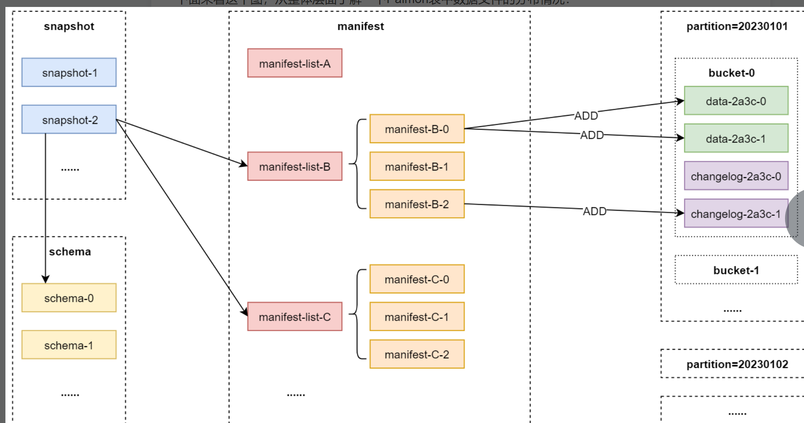

1：快照文件(Snapshot Files)
Paimon表中的所有快照文件都会存储在snapshot目录中，快照文件的内容是JSON格式的，里面包含了这个快照的相关信息，主要包括这个快照使用的schema文件，以及这个快照对应的清单列表。

hdfs dfs -ls /paimon/default.db/data_file_layout/snapshot
hdfs dfs -cat /paimon/default.db/data_file_layout/snapshot/snapshot-1
{
  "version" : 3,
  "id" : 1,
  "schemaId" : 0,
  "baseManifestList" : "manifest-list-161de57e-ed5f-4320-8549-2184a2072dd4-0",
  "deltaManifestList" : "manifest-list-161de57e-ed5f-4320-8549-2184a2072dd4-1",
  "changelogManifestList" : "manifest-list-161de57e-ed5f-4320-8549-2184a2072dd4-2",
  "commitUser" : "ff8f5eec-fbd5-4c42-8f51-3eaa07372f34",
  "commitIdentifier" : 9223372036854775807,
  "commitKind" : "APPEND",
  "timeMillis" : 1695197210790,
  "logOffsets" : { },
  "totalRecordCount" : 1,
  "deltaRecordCount" : 1,
  "changelogRecordCount" : 1,
  "watermark" : -9223372036854775808
}

核心字段解释：
version：代表当前快照的版本，目前不需要特别关注。
id：当前快照id，此字段是自增的，从1开始，每次递增+1。
schemaId：此快照使用的schema文件id。
baseManifestList、deltaManifestList、changelogManifestList：清单列表文件。如果此表没有生成changelog，则changelogManifestList会显示为null。
commitKind：表示此快照是如何生成的，APPEND表示追加写入时产生的，COMPACT表示完全压缩(full-compaction)时产生的。
totalRecordCount：表示本次快照中目前总的数据变更记录数量，这里的数据变更记录数量怎么理解呢？正常情况下就是新增的数据条数，但是也有一些特殊情况，例如：删除操作，如果我们删除了1条数据，那么在数据文件中也会产生一条删除数据的记录，此时这里的数值也会加1。
deltaRecordCount：表示本次快照中新增加的数据变更记录数量。
changelogRecordCount：表示本次快照对应的changelog中新增加的数据变更记录数量。如果此表没有生成changelog，则此处的数值为0。

2：Schema文件(Schema Files)
Paimon表的表结构信息都会存储在schema目录中，Schema文件的内容也是JSON格式的，里面包含了不同版本的表结构信息。
因为表结构信息可能会发生变化，所以schema文件可能会有多个。

hdfs dfs -ls /paimon/default.db/data_file_layout/schema
hdfs dfs -cat /paimon/default.db/data_file_layout/schema/schema-0
{
  "id" : 0,
  "fields" : [ {
    "id" : 0,
    "name" : "id",
    "type" : "INT NOT NULL"
  }, {
    "id" : 1,
    "name" : "name",
    "type" : "STRING"
  }, {
    "id" : 2,
    "name" : "dt",
    "type" : "STRING NOT NULL"
  }, {
    "id" : 3,
    "name" : "hh",
    "type" : "STRING NOT NULL"
  } ],
  "highestFieldId" : 3,
  "partitionKeys" : [ "dt", "hh" ],
  "primaryKeys" : [ "id", "dt", "hh" ],
  "options" : {
    "changelog-producer" : "input"
  },
  "timeMillis" : 1695197202721
}

核心字段解释：
id：当前schema文件编号，从0开始，每次递增+1。
fields：内部是一个json数组，里面包含了表中每个字段的编号、名称、类型。
highestFieldId：最大字段编号。
partitionKeys：分区字段。
primaryKeys：主键字段。
options：表中的属性信息，对应的是建表语句with中指定的属性。

3：清单文件(Manifest Files)
所有的清单列表和清单文件都存储在manifest目录中。
清单列表是一个包含了一部分清单文件名称的集合。
而清单文件是一个包含LSM Tree数据文件和Changelog数据变更记录的文件。例如：它里面会记录对应快照中创建了哪个数据文件，或者删除了哪个数据文件。

hdfs dfs -ls /paimon/default.db/data_file_layout/manifest
其中以manifest-list-开头的文件是清单列表，以manifest-开头的是清单文件。

4：数据文件(Data Files)
Paimon表中的真实数据存储在数据文件中。
目前，数据文件支持orc、parquet和avro这些数据格式，默认使用orc数据格式。

数据文件会按照分区和桶进行分组。每个桶目录中都会包含一个LSM tree和对应的Change log文件。

LSM tree是一种基于磁盘存储的数据结构，他的全称是log-structured merge-tree，可以翻译为日志结构合并树，也可以简称为LSM 树。

Paimon采用LSM tree作为其文件存储的数据结构，目前很多新型数据库都会选择这种数据结构，例如：HBase、TiDB、OceanBase等等。

LSM tree的主要优势是顺序写入，可以提升整体写入性能。

LSM tree会将数据文件组织成多个sorted run。每个sorted run是由一个或者多个数据文件组成的，并且一个数据文件只能属于一个sorted run。
默认情况下，一个sorted run等于Paimon表中的一个data数据文件。

数据文件中的数据会按照主键自动排序，在每个sorted run中，数据文件中的主键范围永远不会重叠

sorted run和数据文件之间的关系:
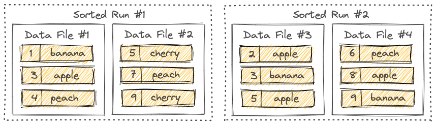
这个图里面一共有两个sorted run。sorted run-1和sorted run-2。

sorted run-1里面有两个data数据文件，其中包含了6条数据，数据的主键分别是1、3、4、5、7、9。
sorted run-2里面也有两个data数据文件，其中包含了6条数据，数据的主键分别是2、3、5、6、8、9。

从这可以看出来，不同的sorted run之间可能会包含重叠的主键范围，甚至可能包含相同的主键。
sorted run 1里面有主键为9的数据，sorted run 2里面也有主键为9的数据，相当于主键为9的数据发生了变化。
所以在查询LSM tree的时候，必须合并所有的sorted run，并且必须根据用户指定的合并引擎和每条数据的时间戳来合并具有相同主键的所有数据。

我们在向LSM tree中写入数据的时候，数据会首先缓存到内存中，当内存缓冲区满的时候，内存中的所有数据会被排序并刷写到磁盘中。
当越来越多的数据写入到LSM tree中的时候，sorted run的数量也会随之增加。

由于我们在查询LSM tree的时候，必须合并所有的sorted run，因此太多的sorted run将会导致查询性能变差，甚至出现内存溢出等问题。

为了限制sorted run的数量，我们需要在某些时机下将多个sorted run合并成一个大的sorted run，这个过程称之为compaction，可以翻译为压缩或者压实。

但是这个压缩是一个资源密集型的过程，会消耗一定的CPU和磁盘IO，所以频繁的压缩可能会导致写入速度变慢。
这就需要我们在查询性能和写入性能之间做一个权衡和取舍了。

Paimon目前采用的压缩策略类似于Rocksdb中的universal compaction这种策略。
默认情况下，当Paimon将数据追加到LSM tree中的时候，他会根据需要自动执行压缩，或者我们也可以选择通过专用压缩作业手工执行压缩。

hdfs dfs -ls /paimon/default.db/data_file_layout/dt=20230101/hh=11/bucket-0
从这可以看出来，数据文件会按照分区和桶进行分组。
从数据文件的后缀名上可以看出来，目前的数据格式是orc格式的。

3. Paimon底层文件操作
我们在操作Paimon表时，这些文件都会发生什么变化。

1：创建表+写入数据
首先创建一个带有分区的paimon表，并且写入数据，触发第一次数据提交。
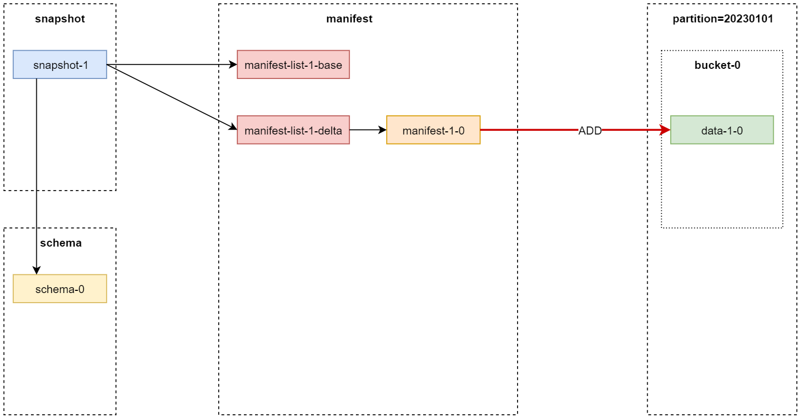
解释：
由于代码中创建了Paimon分区表，并且向表中写入了1条数据，
所以在snapshot目录中会产生一个快照文件：snapshot-1；
在schema目录中会产生一个schema文件：schema-0；
在manifest目录中会产生2个manifest-list清单列表文件和1个manifest清单文件；
注意：图中的manifest-list-1-base其实对应的是hdfs中的manifest-list-xxxx-0这个文件，图中的manifest-list-1-delta其实对应的是hdfs中的manifest-list-xxxx-1，在这里为了便于分析，所以给他们改了名字，这两个manifest-list文件都是和snapshot-1这个快照进行绑定的。

当这个表第一次产生快照文件的时候，manifest-list-1-base这个清单列表文件默认为空，不会指向任何清单文件，因为它本来是要指向上一个快照中对应的清单文件。
manifest-list-1-delta指向的是本次快照中新产生的清单文件。

图中的manifest-1-0其实对应的是manifest-xxxx-0，在这里也是为了便于分析给他改了名字。

从图中可以看出来，manifest-list-1-delta清单列表文件会指向manifest-1-0清单文件，其实我们到hdfs中确认一下，确实是这样的：
hdfs dfs -ls /paimon/default.db/data_file_op/manifest
hdfs dfs -cat /paimon/default.db/data_file_op/manifest/manifest-list-16df1938-7478-4aeb-b45c-d56655c9e488-1
Obj_x0016_avro.schemanull",{"type":"record","name":"record","namespace":"org.apache.paimon.avro.generated","fields":[{"name":"_VERSION","type":"int"},{"name":"_FILE_NAME","type":"string"},{"name":"_FILE_SIZE","type":"long"},{"name":"_NUM_ADDED_FILES","type":"long"},{"name":"_NUM_DELETED_FILES","type":"long"},{"name":"_PARTITION_STATS","type":["null",{"type":"record","name":"record__PARTITION_STATS","fields":[{"name":"_MIN_VALUES","type":"bytes"},{"name":"_MAX_VALUES","type":"bytes"},{"name":"_NULL_COUNTS","type":["null",{"type":"array","items":["null","long"]}],"default":null}]}],"default":null},{"name":"_SCHEMA_ID","type":"long"}]}]avro.codec
                  snappy?(t>^manifest-1eaf0227-8494-4141-a4d2-a48a73aa7a03-08_x0010_20230101r_((?(

虽然清单列表文件不是普通的文本文件，但是也能大致看出来里面的核心内容。

从图中还可以看出来manifest-1-0清单文件会指向20230101分区中，bucket-0桶中的data-1-0数据文件，因为刚才我们执行了INSERT操作，所以会添加一条数据，他们之间的关系也可以到hdfs中查看一下：
hdfs dfs -cat /paimon/default.db/data_file_op/manifest/manifest-1eaf0227-8494-4141-a4d2-a48a73aa7a03-0
Obj_x0016_avro.schemanull",{"type":"record","name":"record","namespace":"org.apache.paimon.avro.generated","fields":[{"name":"_VERSION","type":"int"},{"name":"_KIND","type":"int"},{"name":"_PARTITION","type":"bytes"},{"name":"_BUCKET","type":"int"},{"name":"_TOTAL_BUCKETS","type":"int"},{"name":"_FILE","type":["null",{"type":"record","name":"record__FILE","fields":[{"name":"_FILE_NAME","type":"string"},{"name":"_FILE_SIZE","type":"long"},{"name":"_ROW_COUNT","type":"long"},{"name":"_MIN_KEY","type":"bytes"},{"name":"_MAX_KEY","type":"bytes"},{"name":"_KEY_STATS","type":["null",{"type":"record","name":"record__FILE__KEY_STATS","fields":[{"name":"_MIN_VALUES","type":"bytes"},{"name":"_MAX_VALUES","type":"bytes"},{"name":"_NULL_COUNTS","type":["null",{"type":"array","items":["null","long"]}],"default":null}]}],"default":null},{"name":"_VALUE_STATS","type":["null",{"type":"record","name":"record__FILE__VALUE_STATS","fields":[{"name":"_MIN_VALUES","type":"bytes"},{"name":"_MAX_VALUES","type":"bytes"},{"name":"_NULL_COUNTS","type":["null",{"type":"array","items":["null","long"]}],"default":null}]}],"default":null},{"name":"_MIN_SEQUENCE_NUMBER","type":"long"},{"name":"_MAX_SEQUENCE_NUMBER","type":"long"},{"name":"_SCHEMA_ID","type":"long"},{"name":"_LEVEL","type":"int"},{"name":"_EXTRA_FILES","type":{"type":"array","items":"string"}},{"name":"_CREATION_TIME","type":["null",{"type":"long","logicalType":"timestamp-millis"}],"default":null}]}],"default":null}]}]avro.codec
20230101^data-469dd16f-cc81-4296-84ee-fb535bd11dc1-0.orc

在hdfs中查看paimon表中20230101分区中的数据文件，确实可以看到这个文件：
hdfs dfs -ls /paimon/default.db/data_file_op/dt=20230101/bucket-0
这就是这些文件之间的关系。

当我们查询这个表中最新数据的时候，会先找到snapshot-1快照文件，然后根据manifest-list-1-delta清单列表文件找到具体的清单文件manifest-1-0，最后根据这个清单文件就可以找到具体的data-1-0数据文件了。

2：写入数据
继续向表中写入数据，触发第二次数据提交。

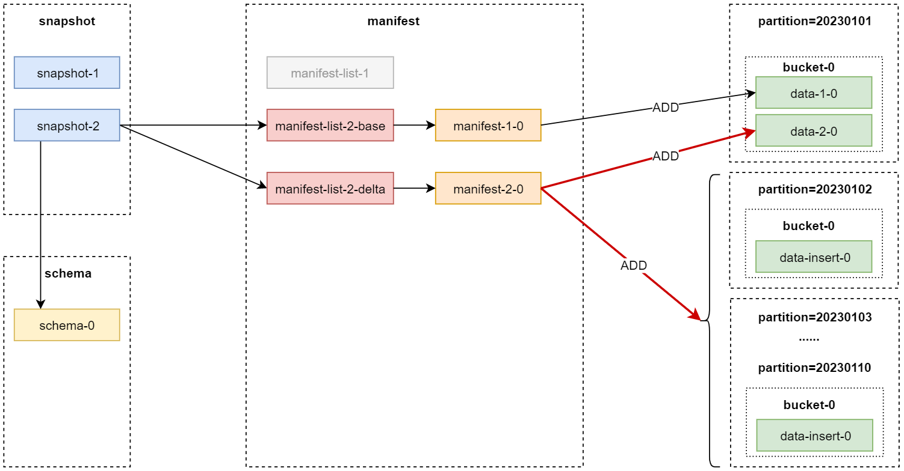
解释：
由于代码中执行了第2次提交，所以在snapshot目录中产生了快照：snapshot-2。
schema目录没有发生变化。
manifest目录中新产生了2个manifest-list清单列表文件和1个manifest清单文件。
注意：之前第一次产生的清单列表文件和清单文件也还是存在的，他们还是和snapshot-1绑定在一起的，此时在图中就没有体现他们之间的关系了，否则这个图看起来就太乱了，图中只重点关注最新快照相关的数据文件。

现在manifest目录中一共有4个manifest-list清单列表文件和2个manifest清单文件，到hdfs中确认一下：
hdfs dfs -ls /paimon/default.db/data_file_op/manifest

此时manifest-list-2-base清单列表文件会指向上一个快照中对应的清单文件：manifest-1-0。
而manifest-list-2-delta清单列表文件会指向本次快照中新产生的清单文件：manifest-2-0。
想要验证的话，也可以到hdfs查看对应的清单列表文件进行确认：
hdfs dfs -cat /paimon/default.db/data_file_op/manifest/manifest-list-3afd7566-5a7c-436f-822d-b18160104044-0
Obj_x0016_avro.schemanull",{"type":"record","name":"record","namespace":"org.apache.paimon.avro.generated","fields":[{"name":"_VERSION","type":"int"},{"name":"_FILE_NAME","type":"string"},{"name":"_FILE_SIZE","type":"long"},{"name":"_NUM_ADDED_FILES","type":"long"},{"name":"_NUM_DELETED_FILES","type":"long"},{"name":"_PARTITION_STATS","type":["null",{"type":"record","name":"record__PARTITION_STATS","fields":[{"name":"_MIN_VALUES","type":"bytes"},{"name":"_MAX_VALUES","type":"bytes"},{"name":"_NULL_COUNTS","type":["null",{"type":"array","items":["null","long"]}],"default":null}]}],"default":null},{"name":"_SCHEMA_ID","type":"long"}]}]avro.codec
                  snappyL>^manifest-1eaf0227-8494-4141-a4d2-a48a73aa7a03-08_x0010_20230101r
注意：这里的清单文件manifest-1eaf0227-8494-4141-a4d2-a48a73aa7a03-0就是上一个快照中产生的清单文件：manifest-1-0。

hdfs dfs -cat /paimon/default.db/data_file_op/manifest/manifest-list-3afd7566-5a7c-436f-822d-b18160104044-1
Obj_x0016_avro.schemanull",{"type":"record","name":"record","namespace":"org.apache.paimon.avro.generated","fields":[{"name":"_VERSION","type":"int"},{"name":"_FILE_NAME","type":"string"},{"name":"_FILE_SIZE","type":"long"},{"name":"_NUM_ADDED_FILES","type":"long"},{"name":"_NUM_DELETED_FILES","type":"long"},{"name":"_PARTITION_STATS","type":["null",{"type":"record","name":"record__PARTITION_STATS","fields":[{"name":"_MIN_VALUES","type":"bytes"},{"name":"_MAX_VALUES","type":"bytes"},{"name":"_NULL_COUNTS","type":["null",{"type":"array","items":["null","long"]}],"default":null}]}],"default":null},{"name":"_SCHEMA_ID","type":"long"}]}]avro.codec
                  snappy87Ű=,'>^manifest-b2759635-da4c-4fed-915c-9CR|87Ű=
注意：这里的清单文件manifest-b2759635-da4c-4fed-915c就是本次快照中产生的清单文件：manifest-2-0。

从图中可以看出来，清单文件manifest-1-0指向的还是之前添加到20230101分区中的数据文件。
而manifest-2-0指向的是本次新添加的数据，一共是10条数据，分别添加到了10个分区里面：20230101~20230110。
此时在分区20230101中的bucket目录中可以看到2个data数据文件，对应的就是2次添加的数据。

3：删除数据
接着执行一个删除数据的操作。
由于代码不支持，所以使用paimon-flink-action这个jar包执行delete任务 delete-table-data.sh。
flink run \
-m yarn-cluster \
-yjm 1024 \
-ytm 1024 \
-yD execution.checkpointing.interval=5sec \
/data/soft/paimon/paimon-flink-action-0.5.0-incubating.jar \
delete \
--warehouse hdfs://XXX:8020/paimon \
--database default \
--table data_file_op \
--where "dt >= '20230103'" \
--catalog-conf type=paimon
注意：where中指定的过滤条件必须使用双引号引起来，否则提交任务会报错
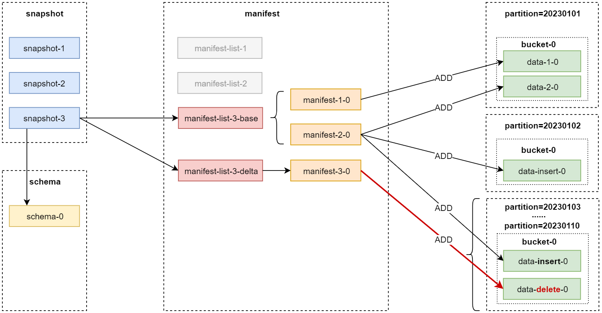
解释：
由于执行了删除操作，也会触发提交，所以在snapshot目录中产生了新的快照：snapshot-3。

那对应的manifest目录中也新产生了2个manifest-list清单列表文件和1个manifest清单文件。
其中manifest-list-3-base会指向上一个快照中对应的清单文件：manifest-1-0和manifest-2-0。
而manifest-list-3-delta会指向本次快照中新产生的清单文件：manifest-3-0。

由于我们在删除操作中指定的过滤条件是dt >= '20230103'，所以分区20230103~20230110中的数据都需要被删除，但是此时并不会立刻真正删除数据，而是会向这些分区的bucket目录中写入一个删除数据的标记文件，对应的是data-delete-0这个数据文件，后期我们在查询的时候也会读取到这些删除标记文件，最终返回数据的时候就会把这些数据过滤掉了。

所以清单文件manifest-3-0指向的其实就是分区20230103~20230110中的data-delete-0数据文件，在这个图中我们进行了简化，将分区20230103~20230110整合到了一起。

4：完全压缩表数据( 触发full-compaction)
此时我们可以发现，表中的data数据文件单独每个都很小，并且这些data数据文件的数量会随着数据的增加而增加，这样后期会影响读取性能，因为小文件数量太多了。
所以，为了减少小文件对读取性能的影响，我们需要对表进行完全压缩操作，进而减少小文件的数量。
执行一个完全压缩表数据的操作，其实就是触发表的full-compaction，这样可以自动完全压实bucket桶内的data数据文件。

由于代码不支持，所以使用paimon-flink-action这个jar包执行compact任务 compact-table-data.sh 。
flink run \
-m yarn-cluster \
-yjm 1024 \
-ytm 1024 \
-yD execution.checkpointing.interval=5sec \
-yD execution.runtime-mode=batch \
/data/soft/paimon/paimon-flink-action-0.5.0-incubating.jar \
compact \
--warehouse hdfs://XXX:8020/paimon \
--database default \
--table data_file_op \
--catalog-conf type=paimon

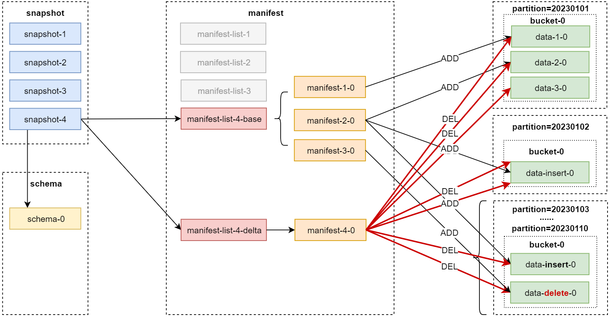
解释：
由于执行了完全压缩操作，也会触发提交，所以在snapshot目录中产生了新的快照：snapshot-4。

注意：此时查看snapshot-4文件的内容，可以发现commitKind属性的值为COMPACT，表示这个快照是执行完全压缩时产生的。

manifest目录中也新产生了2个manifest-list清单列表文件和1个manifest清单文件。
其中manifest-list-4-base会指向上一个快照中对应的清单文件：manifest-1-0、manifest-2-0和manifest-3-0。
而manifest-list-4-delta会指向本次快照中新产生的清单文件：manifest-4-0。

此时这个清单文件manifest-4-0中会包含21个清单条目：其中19个DELETE操作，2个ADD操作。
1：针对20230103~20230110这8个分区，每个分区内部有2个data数据文件，一共是16个data数据文件，由于这些数据文件中的数据之前已经被标记为删除了，所以在压缩的时候只需要把他们删除掉即可，不需要重新产生新的数据文件了，那对应的就会产生16个DELETE操作。注意：这里的DELETE操作，只是在清单文件内部生成对应的删除操作，并没有真正去删除对应的data数据文件。
2：针对20230101这个分区，内部有2个data数据文件，需要对他们进行完全压缩，然后生成1个新的data数据文件(data-3-0)。针对当前这个快照来说，生成新的data数据文件(data-3-0)之后，之前的data数据文件(data-1-0和data-2-0)就不需要再读取了，所以会在清单文件中产生2个DELETE操作和1个ADD操作。
3：针对20230102这个分区，内部有1个data数据文件，也需要进行完全压缩，不过由于只有1个data数据文件，完全压缩之后还是老样子。但是完全压缩的流程还是需要执行的，所以会在清单文件中产生1个DELETE操作和1个ADD操作。

5：修改表的属性
接下来我们修改一下表中的一些属性，给表中添加一下快照过期相关的属性。
ALTER TABLE data_file_op SET (
'snapshot.time-retained' = '1m',
'snapshot.num-retained.min' = '1',
'snapshot.num-retained.max' = '1'
)
解释：
snapshot.time-retained：允许快照过期的时间，1m表示1分钟，实际工作中一般建议设置为小时级别，例如：30h，表示30小时后才允许快照过期。
snapshot.num-retained.min：最小要保留的快照数量。
snapshot.num-retained.max：最多要保留的快照数量。

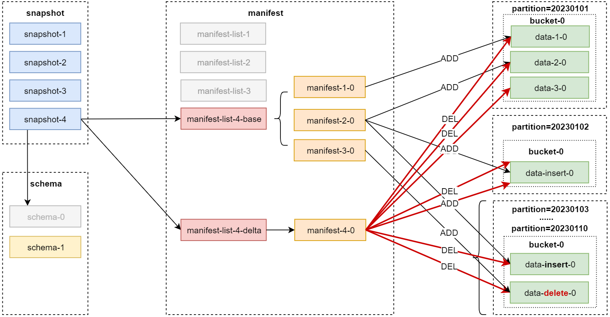
这个操作只会对schema目录产生影响，其他的目录不会发生变化。
在schema目录中会生成一个新的schema-1文件，这个文件中会保存表中最新的schema信息：
到hdfs中查看一下这个文件内容：
hdfs dfs -cat /paimon/default.db/data_file_op/schema/schema-1
{
  "id" : 1,
  "fields" : [ {
    "id" : 0,
    "name" : "id",
    "type" : "INT NOT NULL"
  }, {
    "id" : 1,
    "name" : "code",
    "type" : "INT"
  }, {
    "id" : 2,
    "name" : "dt",
    "type" : "STRING NOT NULL"
  } ],
  "highestFieldId" : 2,
  "partitionKeys" : [ "dt" ],
  "primaryKeys" : [ "id", "dt" ],
  "options" : {
    "snapshot.time-retained" : "1m",
    "snapshot.num-retained.max" : "1",
    "snapshot.num-retained.min" : "1"
  },
  "timeMillis" : 1695367369440
}
在options参数中可以看到刚才给表添加的属性。
此时这个schema-1还没有被其他快照所使用，直到下一次快照产生。
此时就算之前的快照已经满足过期条件了，也不会立刻被删除，必须要等到下次生成新快照的时候才会触发历史快照过期。

6：触发快照过期
下面我们向表中再添加一次数据，触发提交操作，产生新的快照，这样才会真正触发快照过期操作。
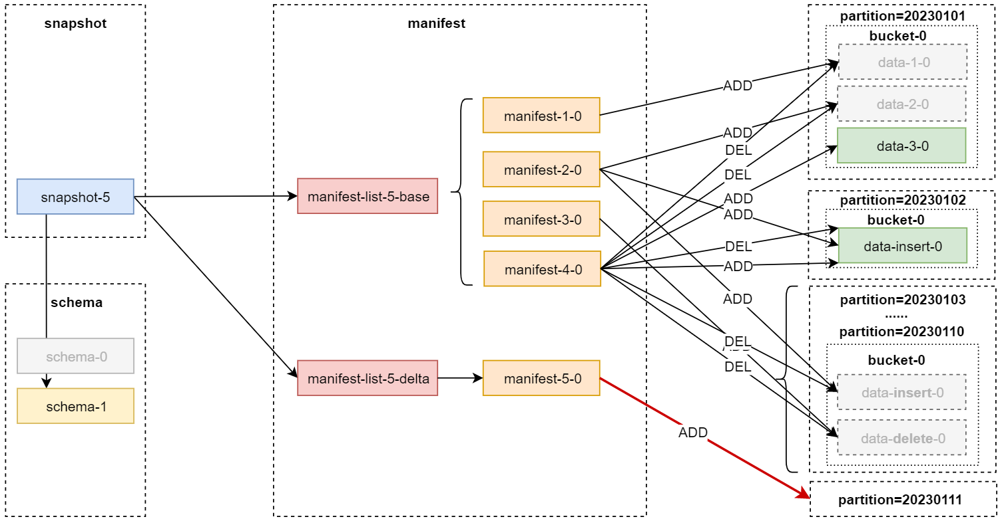
解释：
由于代码中执行了写入操作，所以会触发提交，产生新的快照：snapshot-5。
此时这个快照会使用最新的schema文件：schema-1。
到hdfs中查看snapshot-5快照文件中的schemaId：
hdfs dfs -cat /paimon/default.db/data_file_op/snapshot/snapshot-5
{
  "version" : 3,
  "id" : 5,
  "schemaId" : 1,
  "baseManifestList" : "manifest-list-0cf5cdc8-4f82-41e8-ae51-e12aff8abffd-0",
  "deltaManifestList" : "manifest-list-0cf5cdc8-4f82-41e8-ae51-e12aff8abffd-1",
  "changelogManifestList" : null,
  "commitUser" : "cf986f1f-7f9c-45e0-9856-91cdf26f3d4d",
  "commitIdentifier" : 9223372036854775807,
  "commitKind" : "APPEND",
  "timeMillis" : 1695367707394,
  "logOffsets" : { },
  "totalRecordCount" : 42,
  "deltaRecordCount" : 1,
  "changelogRecordCount" : 0,
  "watermark" : -9223372036854775808
}
在这可以看到，schemaId的值为1，说明此时使用的是schema-1这个文件。

manifest目录中新产生了2个manifest-list清单列表文件和1个manifest清单文件。
manifest-list-5-base指向的是前面4次快照中产生的清单文件。
manifest-list-5-delta指向的是本次快照中产生的清单文件：manifest-5-0。

清单文件manifest-5-0会指向本次新添加的分区20230111中的数据。

在这注意了，在生成本次快照的时候，会触发快照过期操作，前面的4个快照都满足条件，所以都过期被删除了，这个删除是真正的物理删除。

在hdfs中的snapshot目录中目前就只剩下snapshot-5了：
hdfs dfs -ls /paimon/default.db/data_file_op/snaphot
之前的几个快照文件都被删除了，并且和他们相关联的清单列表文件也被删除了。
但是之前的清单文件还存在，因为本次快照中的清单列表文件会用到他们：
hdfs dfs -ls /paimon/default.db/data_file_op/manifest

从这可以看出来，目前一共有7个文件，其中2个清单列表文件（是本次快照生成的），5个清单文件。
之前被标记为删除的数据，此时会被真正删除了，所以分区20230101中的data-1-0和data-2-0数据文件就被删除了，以及分区20230103~20230110中的data数据文件也被删除了，同时分区20230103~20230110这些空目录也会被删除。
schema目录没有发生变化，快照过期不会影响这个目录中的文件。

快照过期的流程：
1：首先，它会找到过期的快照，根据过期快照中清单文件里面DELETE类型的清单条目，找到并删除对应的data数据文件，并记录所有发生变化的bucket。注意：DELETE类型的清单条目对应的data数据文件，就不会被后续快照使用了，所以这里的删除操作是安全的，不会删除正在使用中的数据。
2：然后，它会删除对应的changelog文件，以及关联的清单。
3：最后，它会删除过期的快照文件，并且修改snapshot目录中EARLIEST文件中存储的最早的快照文件编号。
注意：快照文件过期被删除还有一个前提条件，就是没有消费者(Consumer ID)依赖于这个快照。

4. Flink流式写入Paimon表过程分析
通过MySQL的CDC数据摄取功能，来具体分析一下Flink流式写入Paimon表的过程。

首先，我们需要了解一下这个流式写入过程中都会涉及到哪些组件，以及这些组件的含义。
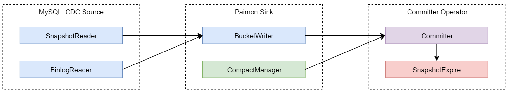
解释：
1：MySQL CDC Source组件负责读取表中的全量快照数据和增量数据，具体是由SnapshotReader负责读取全量快照数据，BinlogReader负责读取增量数据。
2：Paimon Sink组件负责将数据写入Paimon表的bucket中，其中CompactManager负责异步触发Compaction(完全压缩)。
3：Committer Operator组件负责提交数据和触发快照过期，他是一个单例，简单理解就是他在执行的时候只会产生1个子任务，并行度是1。

接下来，我们来看一下端到端数据的执行流程:
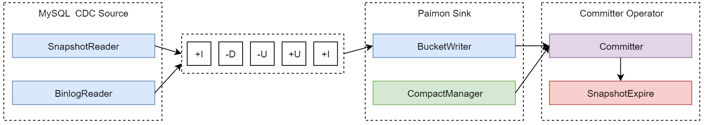
MySQL CDC Source负责读取表中的全量快照数据和增量数据，然后对数据做一些常规的处理，最后通过Paimon Sink把它们发送到下游。

接下来继续:
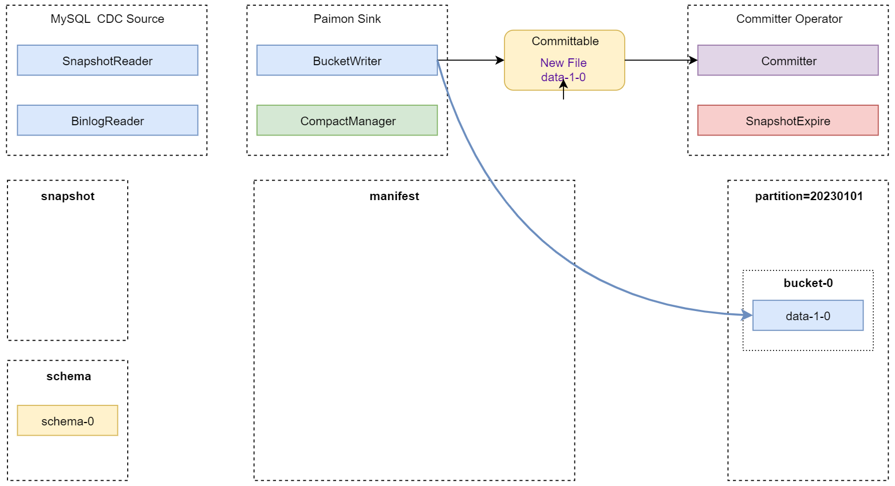
Paimon Sink 在将数据发送到下游的时候，首先将数据缓冲在基于堆内存的 LSM tree中，并在内存缓冲区满的时候将它们刷写到磁盘中。
注意，这里写入的每个数据文件都是Sorted Run。

此时，还没有创建清单和快照。

在 Flink 任务的checkpoint触发之前，Paimon Sink将刷新内存缓冲区中的所有数据并向下游发送可提交消息(Committable)，该提交消息在checkpoint执行期间由Committer Operator组件负责读取并提交。

接下来继续:
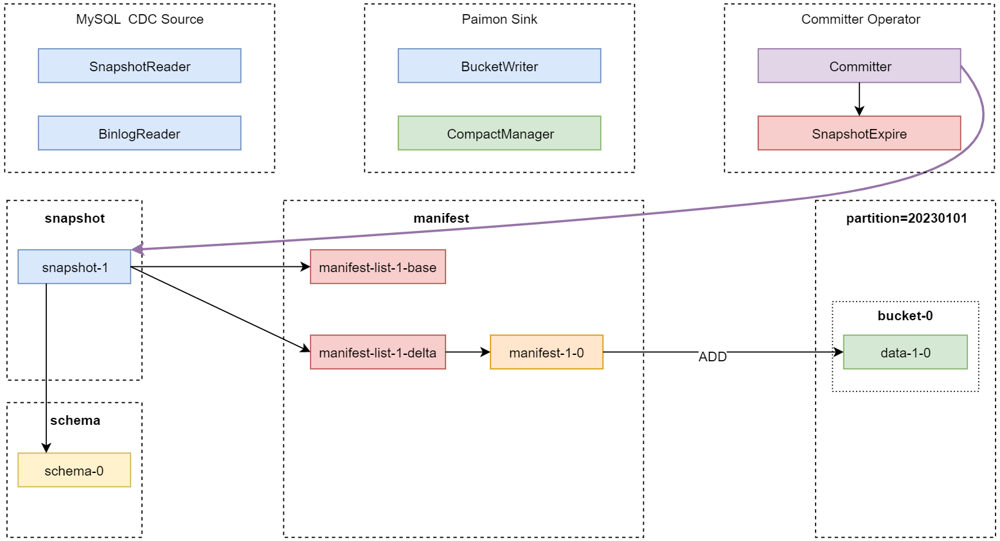
在checkpoint执行期间，Committer Operator 将创建一个新快照并将其与清单列表关联起来，这样该快照就可以指向表中目前对应的数据文件。

接下来继续:
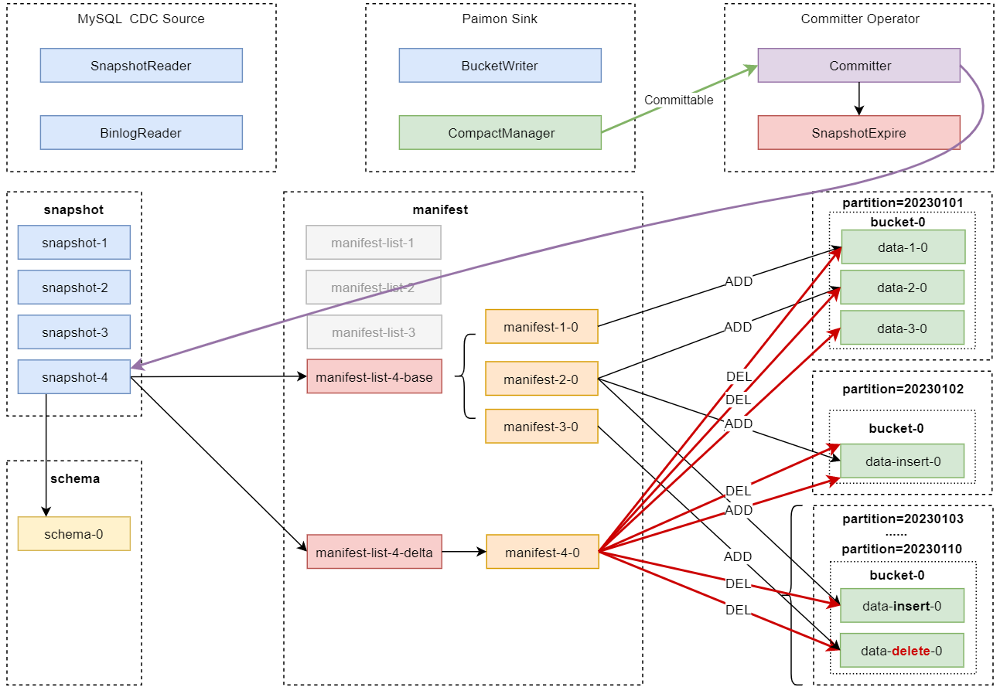
后期可能会由CompactManager异步触发Compaction。
CompactManager生成的提交信息中包含有关历史文件和合并文件的信息，主要是为了方便Committer Operator构造相应的清单条目。
此时Committer Operator可能会在Flink任务的checkpoint执行期间生成2个快照：一个用于写入数据(对应的是Append类型的快照)，另一个用于压缩数据(对应的是Compact类型的快照)。
如果在checkpoint执行期间没有写入新的数据文件，则只会创建一个Compact类型的快照。
此时Committer Operator还会检查之前的快照是否过期，并且将清单条目中标记过DELETE操作的数据文件执行物理删除。

这就是Flink流式写入Paimon表中数据的全流程。

八、Paimon性能优化和管理维护
1. 读写性能
1) 写入性能
Flink的写入性能和checkpoint是密切相关的，所以，如果我们想要提高写入吞吐量，可以重点从checkpoint这块入手，不过也还有一些其他相关的参数可以调整，下面我们来系统的看一下：

1：针对流处理模式，建议增加checkpoint执行间隔时间(execution.checkpointing.interval)，并且增加checkpoint最大并发数量(execution.checkpointing.max-concurrent-checkpoints)，checkpoint最大并发数量可以调整为3。针对批处理模式是不需要开启checkpoint的。
2：增加write-buffer-size的值，这个参数代表的是写缓冲区的内存大小，默认是256M。因为数据在真正写入到磁盘文件之前，会先写入到内存缓冲区里面。增加内存缓冲区的大小，可以减少内存缓冲区刷写文件的次数，进而提高写入能力。
3：开启write-buffer-spillable，这个参数表示写缓冲区是否支持生成溢出文件，开启了之后，如果写缓冲区的内存用完了，是可以将数据溢写到文件中的，这样也可以减少内存缓冲区刷写文件的次数。
4：如果使用的是固定存储桶模式(Fixed Bucket mode)，建议重新调整bucket的数量。
5：Flink任务中sink组件的并行度和Paimon表中bucket的数量建议相等，这样写入性能较好。
6：参数'changelog-producer'='lookup' / 'full-compaction'，以及参数'full-compaction.delta-commits'对写入性能也有较大的影响，建议在全量数据同步阶段取消这些配置；在增量数据同步阶段重新启用这些配置。
7：如果bucket或者任务资源较少，Full Compaction可能会导致checkpoint超时，Flink默认的checkpoint超时时间是10分钟，此时如果想要保证写入操作的稳定性，建议增加checkpoint超时时间。例如：execution.checkpointing.timeout = 60 min。

2) 读取性能
针对读取性能这块，重点需要关注的是完全压缩。

Paimon默认是可以处理小文件，并且提供良好读取性能的，所以不建议在没有任何要求的情况下开启完全压缩(配置full-compaction.delta-commits)，开启完全压缩会对性能产生较大的影响。

针对主键表，在读取的时候采用的是MergeOnRead技术，当我们读取数据时，会自动合并多层LSM Tree数据，此时并行读取任务数量会受到bucket数量的限制。

尽管Paimon的合并性能是高效的，但是主键表的读取性能仍然不如仅追加表(AppendOnly)。

针对主键表，如果我们想要在某些场景下提供高效查询，此时可以借助于完全压缩，但是无法查询到最新的数据结果，具体的操作步骤如下：

（1）：在表中配置full-compaction.delta-commits，在使用Flink引擎写入数据时，此表会定期自动进行完全压缩(Full Compaction)。
（2）：读取数据时，指定scan.mode为compacted-full，此时会读取完全压缩快照中的数据，读取性能较好。
所以我们在实际工作中需要在读取性能和数据延迟之间进行取舍。
针对仅追加表，小文件过多会降低读取性能，影响HDFS的稳定性。

默认情况下，当单个bucket中的小文件数量超过50个(compaction.max.file-num)时，就会触发compact任务执行完全压缩(Full Compaction)。

注意：如果Paimon表中有很多bucket，这样还是可能会产生很多小文件的，因为每个bucket中至少要有1个文件。
此时我们可以使用完全压缩(Full Compaction)来减少小文件的数量，完全压缩将消除大部分小文件。

3) 存储格式和压缩格式
下面我们来看一下文件存储格式和压缩格式对读写性能的影响

首先是存储格式。

Paimon表一共支持三种数据文件存储格式：orc、parquet和avro。

orc：属于行列式存储。
parquet：属于列式存储
avro：属于行式存储。
其中orc属于Paimon默认的存储格式，写入性能和读取性能都不错。

如果想要达到较高的写入性能，可以考虑使用avro，因为它属于行存储，写入效率比较高，但是它的读取性能就比较差了，这也是行存储最大的问题。

如果想要达到较高的读取性能，建议使用parquet，因为Paimon对parquet存储格式的读取做了一些优化，所以查询parquet格式的数据会比orc格式稍快一些。

想要手工指定Paimon表的存储格式，很简单，只需要在创建表的时候在表中设置file.format参数即可，不指定时默认为orc。
例如：'file.format'='avro'
注意：在使用avro存储格式的时候，建议关闭统计信息，因为行存储文件的统计信息收集起来比较消耗资源。通过设置'metadata.stats-mode' = 'none'关闭avro存储格式的统计信息。

接下来看一下压缩格式。
默认情况下，Paimon使用LZ4或者SNAPPY等高性能压缩算法，但是它们的压缩率不太好。

如果想要比较高的压缩率，官方推荐使用ZSTD压缩算法，但是压缩率高的压缩算法一般读写速度都比较慢，会影响读写性能。

针对orc存储格式，可以使用NONE、ZLIB、SNAPPY、LZO、LZ4等压缩算法。

针对parquet存储格式，可以使用UNCOMPRESSED、SNAPPY、GZIP、LZO、BROTLI、LZ4、ZSTD等压缩算法。

想要手工指定Paimon表的压缩格式，很简单，只需要在创建表的时候在表中设置file.compression参数即可，不指定则默认自动选择使用LZ4或者SNAPPY。
例如：'file.compression'='ZSTD'

4) 多Writer并发写入
默认情况下，Paimon表支持对不同分区的并发写入。
官方推荐的方式是使用流处理任务将流数据写入到Paimon表的最新分区中，
同时使用批处理任务定时覆盖写入到历史分区中。
这里的批处理任务相当于实现了基于离线数据定时修正(回填)实时数据的功能，这样其实就解决了离线和实时数据一致性的问题。
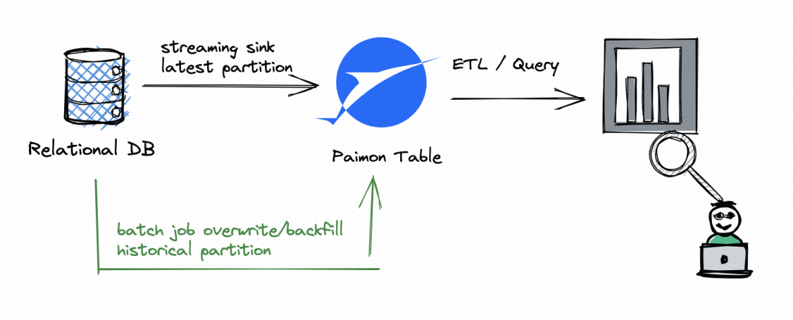

针对企业中的查询需求，实时报表直接查询Paimon表最新分区中的数据即可，此时就算数据有一些偏差也不影响大局。
第二天查询前一天报表的时候，查询的就是Paimon表历史分区中的数据了，此时这份历史数据已经被修正过了。

多个Writer并发写入到Paimon表的不同分区，这个流程正常情况下不会遇到什么问题，但是如果多个Writer同时写入同一个分区，那就有点复杂了，针对这种需求有两种方案：
1：借助于partial-update这种合并引擎，在Flink任务中使用UNION ALL实现多Writer并发写入。
2：借助于完全压缩任务，需要使用paimon-flink-action jar包定时提交compact任务。

下面我们重点分析一下第二种方案：
默认情况下，Paimon的多个writer在向表中写入数据时会根据需要执行完全压缩，针对大部分的场景，这样就可以了，但是这样会有一些缺点：

这样可能会导致写入性能不稳定，因为在执行完全压缩时会导致写入性能暂时下降。
完全压缩会将某些数据文件标记为删除，但是并没有真正删除。如果多个Writer标记了同一个文件，则在提交更改时会发生冲突，不过不用担心，Paimon会自动解决冲突，但是可能会导致任务重新启动。
为了避免这些缺点，我们可以选择在多Writer写入数据时跳过压缩，后期专门启动单独的作业执行完全压缩，这样就可以避免发生冲突。

想要在Writer写入数据时跳过压缩，只需要在表中配置'write-only'='true'即可。
此参数设置为true之后，Paimon表的完全压缩和快照过期策略都会失效，这个参数需要配合单独的完全压缩作业一起使用，否则这个Paimon表中的数据文件就永远无法合并了。

2. 管理快照
Paimon中的Writer每次提交都会产生1~2个快照，每个快照可能会添加一些新的数据文件，或者是将一些旧的数据文件标记为删除。
标记为删除的数据文件并没有真正被删除，因为Paimon还支持时间旅行功能查询更早的快照，这些快照只在触发过期策略的时候才会被删除。

目前，Paimon中的Writer在提交新更改的时候会自动执行过期操作，检查过期的快照并删除。
通过使旧快照过期，可以删除不再使用的旧数据文件和元数据文件，进而释放磁盘空间，提高磁盘的使用效率。

快照过期是通过3个参数来控制的:
snapshot.time-retained：允许快照过期的时间，1m表示1分钟，实际工作中一般建议设置为小时级别，例如：30h，表示30小时后才允许快照过期。
snapshot.num-retained.min：最小要保留的快照数量。
snapshot.num-retained.max：最多要保留的快照数量。

借助于paimon-flink-action这个jar包中的rollback-to功能，可以实现将表回滚到指定快照ID

3. 管理分区
针对Paimon分区表中的分区，只要我们不手工删除，这些分区默认会一直存在。
针对比较老的分区中的数据，其实可以考虑删除，这样可以减少磁盘空间的占用。

删除分区的时候，我们可以手工删除，或者是给分区设置过期时间实现自动删除。
我们可以在创建paimon分区表的时候设置partition.expiration-time参数，这样Paimon会定期检查表中分区的状态，并根据时间删除过期的分区。

如何判断分区过期呢？
只需要将分区中提取到的时间和当前时间求一个差值，如果差值超过了partition.expiration-time参数指定的值，则说明分区过期了。

注意：分区过期后，只是被标记为删除，也可以称之为逻辑删除，这样查询最新的快照就无法查询到这个分区中的数据了。但是底层文件系统中的数据文件并不会立即被物理删除，而是取决于对应的快照何时过期，快照过期的时候才会被真正删除。

针对单个分区字段的表：
CREATE TABLE t1 (...) PARTITIONED BY (dt) WITH (
    'partition.expiration-time' = '7 d',
    'partition.expiration-check-interval' = '1 d',
    'partition.timestamp-formatter' = 'yyyyMMdd'
);
解释：
partition.expiration-time：分区的过期时间。
partition.expiration-check-interval：检查分区过期的时间间隔。
partition.timestamp-formatter：指定分区字段值的解析规则，默认会从第一个分区字段值中进行解析。

针对多个分区字段的表：
CREATE TABLE t1 (...) PARTITIONED BY (other_key, dt) WITH (
    'partition.expiration-time' = '7 d',
    'partition.expiration-check-interval' = '1 d',
    'partition.timestamp-formatter' = 'yyyyMMdd',
    'partition.timestamp-pattern' = '$dt'
);
解释：
partition.timestamp-pattern：针对多个分区字段，可以通过$指定从哪个分区字段中解析时间。

注意：这里说的自动删除过期分区并不是我们理解的在后台启动一个定时任务定时监控分区是否过期。因为我们在使用Paimon的时候并没有启动任何后台服务，所以这里的自动删除指的是我们在后续执行提交操作的时候才可能会触发这个定时任务实现自动删除。

在实际工作中也不太建议使用自动删除分区功能，建议手工删除，这样数据更加可控。
手工删除分区有两种办法
1：可以使用INSERT OVERWRITE语句向指定分区插入空值，达到删除分区数据的目的。但是这种方式每次只能删除1个分区
2：借助于paimon-flink-action 这个jar包，提交drop-partition任务，此时可以一次删除多个分区。

开发drop-partition任务 drop-table-partition.sh
flink run \
/data/soft/paimon/paimon-flink-action-0.5.0-incubating.jar \
drop-partition \
--warehouse hdfs://XXX:8020/paimon \
--database default \
--table man_manage_par \
--partition dt=20230101,hh=10 \
--partition dt=20230102,hh=12 \
--catalog-conf type=paimon
解释：
通过多个--partition可以指定删除多个分区。
在--partition内部通过逗号指定多级分区的过滤条件。
注意：这个功能不会向YARN集群中提交flink任务，相当于执行了一个本地的单机程序。
hdfs dfs -ls /paimon/default.db/man_manage_par/dt=20230101
hdfs dfs -ls /paimon/default.db/man_manage_par/dt=20230102

4. 管理小文件
小文件可能会导致：
稳定性问题：HDFS中小文件过多，会导致NameNode承受过大的压力。
成本问题：HDFS中小文件过多，会导致HDFS存储能力下降。
查询效率问题：小文件过多会影响查询效率。

如果避免产生很多小文件呢？可以从多个方面进行分析
1：checkpoint
假设我们使用的是flink writer，每次触发checkpoint都会生成1~2个快照，并且checkpoint也会在HDFS上生成文件，所以checkpoint间隔越小，则会生成越多的小文件。
所以首先要增加checkpoint的间隔时间，其次是增加write-buffer-size的大小，或者是启用write-buffer-spillable，这样也可以减少HDFS中的小文件数量。

2：snapshot
Paimon表中的数据文件只有在快照过期后才会被真正删除，因此调小快照过期的时间也可以减少小文件的数量。

3：partition和bucket
Paimon表中的数据最终会存储到不同分区中的桶里面。
如果Paimon表中的整体数据量比较小，由于单个桶中至少要有一个文件，所以建议给这个表配置较小的桶数量，否则也会产生很多小文件。

4：主键表中的LSM
LSM tree会将数据文件组织成多个sorted run。每个sorted run是由一个或者多个数据文件组成的，并且一个数据文件只能属于一个sorted run。

默认情况下，sorted run的数量取决于num-sorted-run.compaction-trigger(这个参数的默认值是5)，这意味着一个桶中至少有5个数据文件时才会进行完全压缩。
如果减少这个数值，对应的数据文件个数就会变小，但是写入性能可能会受到影响，因为这样触发完全压缩的频率就比较高了。

5：仅追加表中的文件
默认情况下，仅追加表(Append-Only)会自动进行完全压缩，减少小文件的数量。

但是，对于仅追加表中的桶(bucket)，只能基于顺序的目的压缩桶中的文件，此时单个桶中最多可能会有50个文件（这个数值是由compaction.max.file-num进行控制的），这样可能还是会保留较多的小文件，可以考虑调小这个参数的值。

6：Full-Compaction(完全压缩)
也许我们觉得主键表中每个桶里面至少有5个文件还可以接受，但是仅追加表中的每个桶里面可能会有50个小文件，这就有点多了。
更糟糕的是，之前不再使用的历史分区中可能也像这样保留了很多小文件。

此时需要开启完全压缩来减少小文件的数量。

5. 管理标签
通过Paimon表中的快照，我们可以很方便的查询表中的历史数据。
但是默认情况下，一个表会生成太多快照，并且还会根据表配置使快照过期。快照过期会删除对应的数据文件，过期快照对应的数据就无法再查询了。

为了解决这个问题，我们可以基于指定快照创建标签，标签会维护这个快照的清单和数据文件，这样这个快照就不会过期了。
简单来说就是Paimon表中的标签特性可以让某一些快照长期保留。

典型的应用场景是每天凌晨定时创建标签，这样就可以维护每天的历史数据以便于后期进行批量读取了。

标签可以自动创建、删除，也可以手工进行管理。

1) 自动管理标签
Paimon支持在写入数据的任务中实现自动创建标签。
注意：这里的自动创建标签也需要依赖于提交操作，如果没有提交操作，也是无法实现自动创建标签的。

想要实现自动创建标签，需要以下几个步骤：

1：选择创建模式
我们可以通过参数tag.automatic-creation来控制标签的创建模式。
这个参数有三种取值：none、process-time和watermark。

none：表示不开启自动创建标签功能。
process-time：表示根据服务器上的时间创建标签。
watermark：表示根据Sink任务输入数据的watermark时间创建标签。
注意：如果选择使用watermark这种方式，可能还需要指定watermark时间对应的时区，如果不是UTC时区，则需要通过参数sink.watermark-time-zone来指定时间对应的时区。

2：选择创建频率
我们可以通过参数tag.creation-period来控制标签的创建频率。
这个参数有三种取值：daily、hourly和two-hours。

daily：表示每天生成1个标签。
hourly：表示每小时生成1个标签。
two-hours：表示每两个小时生成1个标签。
3：设置延迟时间
如果需要等待迟到的数据，可以通过参数tag.creation-delay配置一个延迟时间。
这个参数的默认值为0 ms，也就是说当到达标签生成时间的时候就立刻生成标签。
如果我们希望到达标签生成时间的时候再等待5分钟，则可以给这个参数设置值为5 m。

4：设置允许保留的最大标签数量
标签创建之后，默认会一直存在，其实我们一般只需要使用最近半年或者1年内的标签，所以我们可以通过参数tag.num-retained-max来指定允许保留的最大标签数量，实现自动删除过期的标签。
这个参数的默认值为none，表示标签会一直存在，不会自动被删除。
我们可以设置'tag.num-retained-max'='30'，表示最多保留30个标签，超过这个数量之后，会从最早的标签开始自动删除。

在idea中执行代码，执行第一次写入操作
此时到hdfs目录中查看这个表的目录信息: hdfs dfs -ls /paimon/default.db/auto_manage_tag
在这里可以发现多了一个tag目录，这个目录里面存储的就是标签相关的信息。
查看tag目录中的内容：hdfs dfs -ls /paimon/default.db/auto_manage_tag/tag

标签文件的命名格式是：tag-年-月-日 小时
查看标签文件的内容：
{
  "version" : 3,
  "id" : 1,
  "schemaId" : 0,
  "baseManifestList" : "manifest-list-245ab173-3059-4f85-868d-68b2b298b720-0",
  "deltaManifestList" : "manifest-list-245ab173-3059-4f85-868d-68b2b298b720-1",
  "changelogManifestList" : null,
  "commitUser" : "7eea1507-3abe-43cb-9de5-1d052c51f913",
  "commitIdentifier" : 9223372036854775807,
  "commitKind" : "APPEND",
  "timeMillis" : 1696666366843,
  "logOffsets" : { },
  "totalRecordCount" : 1,
  "deltaRecordCount" : 1,
  "changelogRecordCount" : 0,
  "watermark" : -9223372036854775808
}
可以发现和快照文件内容是类似的，所以我们前面说标签会维护快照对应的清单和数据文件。

在idea中执行代码，执行第二次写入操作

此时就不会再生成标签了，因为目前的策略是每小时生成1个标签，同一个小时执行多次写入不会多次触发生成标签。

等到下一个小时的时候，在idea中执行代码，执行第三次写入操作

注意：需要等到第5分钟之后再执行，否则也不会触发生成标签，因为我们设置了'tag.creation-delay' = '5 m'。不过这个参数在第一次生成标签的时候是不生效的。

再次到hdfs中查看标签信息： hdfs dfs -ls /paimon/default.db/auto_manage_tag/tag
此时发现又新增了一个标签。

注意：如果我们设置'tag.num-retained-max' = '1'的话，此时就只会保留1个标签了，之前的标签会被删除。
由于后面查询的时候我们还想使用到前面的标签，所以给tag.num-retained-max设置的值为2，这样两个标签都会保留下来。

后续只要表中一直有新数据写入，那么标签就会每小时自动创建1个，这样就实现了自动创建标签。

Paimon表的标签除了可以在hdfs中查看，其实也可以通过对应的系统表进行查询

Paimon中提供了tags这个系统表，可以查看表中的标签信息

从这里的tag_name和snapshot_id字段其实可以看出来标签和快照之间的对应关系。

Paimon表中的标签主要是为了便于后期查询表中的历史数据
注意：基于标签进行查询的时候，只能在批处理模式下执行。

在Hive中使用标签查询paimon表中的数据:
由于此时paimon的元数据没有存储在hive中，所以需要先在hive中创建一个外部表auto_manage_tag_external指向paimon中的表auto_manage_tag。
CREATE EXTERNAL TABLE auto_manage_tag_external
STORED BY 'org.apache.paimon.hive.PaimonStorageHandler'
LOCATION 'hdfs://bigdata01:9000/paimon/default.db/auto_manage_tag';
查询外部表：auto_manage_tag_external， 此时可以查到最新的3条数据
查询指定标签中的数据数据：
SET paimon.scan.tag-name=2023-10-07 15;
SELECT * FROM auto_manage_tag_external;
注意：此时paimon.scan.tag-name的值不能使用单引号或者双引号。

2) 手工管理标签
我们可以手工指定基于哪个快照ID来创建标签。
注意：标签名称不能是数字。
此时需要借助于paimon-flink-action这个jar包中的create-tag功能来实现。
开发创建标签的任务脚本 create-table-tag.sh :
flink run \
/data/soft/paimon/paimon-flink-action-0.5.0-incubating.jar \
create-tag \
--warehouse hdfs://XXX:8020/paimon \
--database default \
--table man_manage_tag \
--tag-name t-20230101 \
--snapshot 2 \
--catalog-conf type=paimon
注意：这个功能不会向YARN集群中提交flink任务，相当于执行了一个本地的单机程序。
此时可以到hdfs中看到表man_manage_tag生成了一个标签文件：
hdfs dfs -ls /paimon/default.db/man_manage_tag/tag
注意：文件名称中的tag-是固定的，标签名称是t-20230101。
SELECT * FROM `paimon_catalog`.`default`.`man_manage_tag`
/*+ OPTIONS('scan.tag-name' = 't-20230101') */ -- 指定想要查询的标签的名称

如果某一些标签后期不需要使用了，那么我们可以借助于paimon-flink-action这个jar包中的delete-tag功能删除指定名称的标签。
开发脚本 delete-table-tag.sh:
flink run \
/data/soft/paimon/paimon-flink-action-0.5.0-incubating.jar \
delete-tag \
--warehouse hdfs://XXX:8020/paimon \
--database default \
--table man_manage_tag \
--tag-name t-20230101 \
--catalog-conf type=paimon
到hdfs中确认一下这个标签是否存在：
hdfs dfs -ls /paimon/default.db/man_manage_tag/tag
此时发现tag目录里面什么都没有了，说明t-20230101这个标签被删除了

除了可以创建和删除标签，我们还可以将Paimon表数据回滚到指定标签，此时所有快照id大于该标签的快照和标签都会被删除。
注意：此时对应的数据文件也会被删除，这里的删除是物理删除。

此时需要借助于paimon-flink-action这个jar包中的rollback-to功能来实现回滚。

什么场景会用到这个回滚功能呢？
有时候任务如果出问题了，可能需要将数据回滚到之前的某个时刻。

注意：想要实现回滚需要先有标签，man_manage_tag表中的标签我们刚才删除了，所以还需要创建一个标签。
开发回滚任务脚本 rollback-table-data.sh:
flink1-15 run \
/data/soft/paimon/paimon-flink-action-0.5.0-incubating.jar \
rollback-to \
--warehouse hdfs://XXX:8020/paimon \
--database default \
--table man_manage_tag \
--version t-20230101 \
--catalog-conf type=paimon

6. 管理Bucket
由于Bucket的数量对表的读写性能影响较大，所以Paimon支持用户通过ALTER TABLE命令调整表中bucket的数量，并且使用INSERT OVERWRITE重新分布数据，不需要重新创建表或者分区。
当执行INSERT OVERWRITE的时候，Paimon会自动扫描旧bucket中的数据，然后根据当前最新的bucket编号对数据进行哈希处理，实现数据重新分布。

注意：
ALTER TABLE只会修改表的元数据，不会重新分布表中已有的数据。重新分布数据必须通过INSERT OVERWRITE来实现，所以这两条命令需要结合在一起使用。

重新缩放表中bucket的数量不会影响读取和正在运行的写入任务。

如果表中的bucket编号发生了变化，但是数据还没有重新分布，此时通过新的INSERT INTO任务向这个表中写入数据的时候，会抛出TableException异常日志。

针对分区表，不同分区中的bucket数量可以不相同。

在使用INSERT OVERWRITE重新分布数据时，需要保证没有其他任务同时写入同一个分区/表。

其实重新缩放bucket的数量，主要是为了处理突然出现数据激增的情况。

案例场景：
我们有一个Flink流处理任务，这个任务负责从kafka中读取用户行为数据进行清洗，最终将结果写入到Paimon表中。

这个任务已经平稳运行了几个月，但是最近由于数据量激增，导致任务的写入延迟变得比较大。

想要提高写入能力的话需要增加任务并行度，但是目前任务的并行度已经和Paimon表的bucket数量一致了。
因此单纯的增加任务并行度已经没有意义了，需要先增加Paimon表的bucket数量，再增加任务并行度才有意义。

整体的处理流程：
1：首先停止出现了写入延迟的流处理任务，在停止的时候触发一次savepoint，便于后期恢复任务时使用。因为后面需要对任务进行代码升级，所以使用savepoint。
2：修改Paimon表的bucket数量。
3：执行一个批处理任务，核心逻辑是使用INSERT OVERWRITE覆盖流处理任务当前操作的分区中的数据，这样做的目的是为了重新分布当前分区中的数据，因为bucket的数量发生了变化；表中之前的分区不需要重新分布数据，不影响后续读取。如果不是分区表，则需要覆盖整个表中的所有数据实现重新分布。
4：修改流处理任务中的并行度，建议并行度等于修改后的Paimon表的bucket数量，最后基于前面生成的savepoint重新恢复执行此流处理任务即可。

1) 创建流处理任务+停止任务触发savepoint
由于需要用到kafka，所以需要到项目的pom.xml中添加相关的依赖：
<!-- flink-connector-kafka -->
<dependency>
    <groupId>org.apache.flink</groupId>
    <artifactId>flink-connector-kafka</artifactId>
    <version>1.15.0</version>
    <!--<scope>provided</scope>-->
</dependency>
<!-- flink-json -->
<dependency>
    <groupId>org.apache.flink</groupId>
    <artifactId>flink-json</artifactId>
    <version>1.15.0</version>
    <!--<scope>provided</scope>-->
</dependency>
<!-- Hadoop中的commons-cli版本过低 -->
<dependency>
    <groupId>commons-cli</groupId>
    <artifactId>commons-cli</artifactId>
    <version>1.5.0</version>
    <!--<scope>provided</scope>-->
</dependency>
FlinkSQLWriteToPaimonForBucket_1 

任务中需要用到paimon_word这个topic，先到kafka中创建：
注意：需要提前启动kafka相关服务。
kafka-topics.sh --create --bootstrap-server xx1:9092,xx2:9092,xx3:9092 --partitions 5 --replication-factor 2 --topic paimon_word

向项目的pom.xml中添加编译打包插件：
<build>
    <plugins>
        <!-- 编译插件 -->
        <plugin>
            <groupId>org.apache.maven.plugins</groupId>
            <artifactId>maven-compiler-plugin</artifactId>
            <version>3.6.0</version>
            <configuration>
                <source>1.8</source>
                <target>1.8</target>
                <encoding>UTF-8</encoding>
            </configuration>
        </plugin>
        <!-- scala编译插件 -->
        <plugin>
            <groupId>net.alchim31.maven</groupId>
            <artifactId>scala-maven-plugin</artifactId>
            <version>3.1.6</version>
            <configuration>
                <scalaCompatVersion>2.12</scalaCompatVersion>
                <scalaVersion>2.12.11</scalaVersion>
                <encoding>UTF-8</encoding>
            </configuration>
            <executions>
                <execution>
                    <id>compile-scala</id>
                    <phase>compile</phase>
                    <goals>
                        <goal>add-source</goal>
                        <goal>compile</goal>
                    </goals>
                </execution>
                <execution>
                    <id>test-compile-scala</id>
                    <phase>test-compile</phase>
                    <goals>
                        <goal>add-source</goal>
                        <goal>testCompile</goal>
                    </goals>
                </execution>
            </executions>
        </plugin>
        <plugin>
            <groupId>org.apache.maven.plugins</groupId>
            <artifactId>maven-shade-plugin</artifactId>
            <version>3.1.0</version>
            <executions>
                <execution>
                    <phase>package</phase>
                    <goals>
                        <goal>shade</goal>
                    </goals>
                    <configuration>
                        <transformers>
                            <transformer implementation="org.apache.maven.plugins.shade.resource.AppendingTransformer">
                                <resource>reference.conf</resource>
                            </transformer>
                            <transformer implementation="org.apache.maven.plugins.shade.resource.ServicesResourceTransformer"/>
                            <transformer implementation="org.apache.maven.plugins.shade.resource.ApacheNoticeResourceTransformer">
                                <projectName>Apache Flink</projectName>
                                <encoding>UTF-8</encoding>
                            </transformer>
                        </transformers>
                        <filters>
                            <filter>
                                <artifact>*:*</artifact>
                                <excludes>
                                    <exclude>module-info.class</exclude>
                                    <exclude>META-INF/*.SF</exclude>
                                    <exclude>META-INF/*.DSA</exclude>
                                    <exclude>META-INF/*.RSA</exclude>
                                </excludes>
                            </filter>
                        </filters>
                    </configuration>
                </execution>
            </executions>
        </plugin>
    </plugins>
</build>

将pom.xml中的依赖都添加provided配置，除了flink-table-api-scala-bridge_2.12、flink-connector-kafka、flink-json和commons-cli。

使用maven命令打jar包：mvn clean package -DskipTests

将jar包提交到服务器中，并使用flink客户端向集群中提交任务：
flink run -m yarn-cluster -c com.imooc.paimon.rescalebucket.FlinkSQLWriteToPaimonForBucket_1 -yjm 1024 -ytm 1024 db_paimon-1.0-SNAPSHOT.jar
注意：需要提前启动hadoop集群的historyserver日志服务，否则无法查看日志。

等待任务成功运行起来。
接着启动一个kafka的消费者，向topic：paimon_word中模拟产生一批数据：
kafka-console-producer.sh --broker-list XXX:9092 --topic paimon_word
{"id":1,"word":"hello1"}
{"id":2,"word":"hello2"}
{"id":3,"word":"hello3"}
{"id":4,"word":"hello4"}
{"id":5,"word":"hello5"}
{"id":6,"word":"hello6"}
{"id":7,"word":"hello7"}
{"id":8,"word":"hello8"}
{"id":9,"word":"hello9"}
{"id":10,"word":"hello10"}
{"id":11,"word":"hello11"}
{"id":12,"word":"hello12"}
{"id":13,"word":"hello13"}
{"id":14,"word":"hello14"}
{"id":15,"word":"hello15"}
{"id":16,"word":"hello16"}
{"id":17,"word":"hello17"}
{"id":18,"word":"hello18"}
{"id":19,"word":"hello19"}
{"id":20,"word":"hello20"}
注意：我们在这里模拟产生了20条数据，这些数据被任务处理之后，其实只会剩下19条数据，word=hello11的那条数据会被过滤掉。
查询一下paimon中表word_filter中的数据: FlinkSQLReadFromPaimon
在idea中执行代码。
注意：需要先修改pom.xml中的provided配置，注释掉所有依赖中的provided配置即可。
到hdfs中查看这个表的bucket目录：hdfs dfs -ls /paimon/default.db/word_filter/dt=20230101

在这里可以看到4个bucket目录，说明这19条数据分到了4个bucket目录中，最多会出现5个bucket，因为我们给这个表设置的bucket数量为5.
这样就实现了流任务的正常执行。

假设目前遇到了数据激增，写入延迟的问题，那么我们就需要停止任务并触发savepoint了。
flink stop --savepointPath hdfs://XXX:8020/flink/sap f71c4fb21efe4e947cc9d6f90ef8f8fb -yid application_1869188622029_0002
注意：此时flink任务停止了，但是yarn集群中的flink集群还没有停止，需要我们手工停止。
yarn application -kill application_1869188622029_0002

2) 修改Paimon表的bucket数量
接下来根据数据量进行评估，对Paimon表的bucket数量进行适当的缩放。
针对目前这个案例，我们需要增加Paimon表的bucket数量，在这里将bucket数量增加到10。
FlinkSQLAlterPaimonTableForBucket_2
在idea中执行此代码即可，当然也可以提交到集群中运行。
到hdfs目录中，可以看到这个表的schema目录中增量了一个schema文件：
hdfs dfs -ls /paimon/default.db/word_filter/schema
hdfs dfs -cat /paimon/default.db/word_filter/schema/schema-1
{
  "id" : 1,
  "fields" : [ {
    "id" : 0,
    "name" : "id",
    "type" : "BIGINT NOT NULL"
  }, {
    "id" : 1,
    "name" : "word",
    "type" : "STRING"
  }, {
    "id" : 2,
    "name" : "dt",
    "type" : "STRING NOT NULL"
  } ],
  "highestFieldId" : 2,
  "partitionKeys" : [ "dt" ],
  "primaryKeys" : [ "id", "dt" ],
  "options" : {
    "bucket" : "10"
  },
  "timeMillis" : 1696909296626
}
在这里也可以看到表中的bucket属性值变成了10。

但是此时表中的bucket目录还没有发生变化，只是对表的schema信息做了修改。
hdfs dfs -ls /paimon/default.db/word_filter/dt=20230101
注意：此时我们修改了表的bucket数量，不会影响读取任务和正在运行的写入任务。但是如果现在重新提交一个INSERT INTO写入任务就会报错了，提示表的bucket数量和已有的bucket不匹配。

这个其实也好理解，因为之前是按照5个bucket写入的数据，现在是10个bucket了，那么这些数据就需要重新分布之后才能写入新数据了。
如果你后续不需要向这个分区中写入新数据，只会进行查询，那么是不需要对数据进行重新分布的。

3) 执行批处理任务覆盖当前分区的数据
注意：此时需要使用INSERT OVERWRITE。
FlinkSQLWriteToPaimonForBucket_3
将pom.xml中的依赖都添加provided配置，除了flink-table-api-scala-bridge_2.12、flink-connector-kafka、flink-json和commons-cli。

使用maven命令打jar包：mvn clean package -DskipTests
将jar包提交到服务器中，并使用flink客户端向集群中提交任务：
flink run -m yarn-cluster -c com.imooc.paimon.rescalebucket.FlinkSQLWriteToPaimonForBucket_3 -yjm 1024 -ytm 1024 db_paimon-1.0-SNAPSHOT.jar

此时提交的是一个批处理任务。

等待任务执行成功，重新查询一下表中最新的数据：
注意：需要先修改pom.xml中的provided配置，注释掉所有依赖中的provided配置即可。
此时还是可以看到19条数据，这些数据只是被重新写入了一次而已。

到hdfs目录中查看表中最新的bucket目录：hdfs dfs -ls /paimon/default.db/word_filter/dt=20230101

此时可以看到生成了7个bucket目录，相当于把之前的数据重新分布到了这7个bucket目录中，最多会生成10个bucket目录。

这样就通过批处理任务对这个分区中的数据进行了重新分布，后面就可以启动流处理任务继续向这个分区中写数据了。

这个批处理任务执行结束后，YARN中的flink集群也需要手工停止一下。
yarn application -kill application_1869188622029_0003

4) 修改流处理任务中的并行度并重新提交任务
由于目前表中的bucket数量已经修改为10了，所以需要将流任务中的并行度改为10，同步的也建议修改一下建表语句中的bucket数量。
FlinkSQLWriteToPaimonForBucket_4

将pom.xml中的依赖都添加provided配置，除了flink-table-api-scala-bridge_2.12、flink-connector-kafka、flink-json和commons-cli。

使用maven命令打jar包：mvn clean package -DskipTests

将jar包提交到服务器中，并使用flink客户端向集群中提交任务：
flink run -m yarn-cluster -s hdfs://xxx:8020/flink/sap/savepoint-f71c4f-0626aa3b13bf/_metadata -c com.imooc.paimon.rescalebucket.FlinkSQLWriteToPaimonForBucket_4 -yjm 1024 -ytm 1024 db_paimon-1.0-SNAPSHOT.jar

注意：此时提交任务的时候需要基于前面生成的savepoint数据进行恢复，这样可以接着之前的处理进度继续处理。

等待任务执行成功。
向kafka中再模拟产生几条数据：
kafka-console-producer.sh --broker-list xxx:9092 --topic paimon_word
{"id":21,"word":"hello21"}
{"id":22,"word":"hello22"}
重新查询一下表中最新的数据：
注意：需要先修改pom.xml中的provided配置，注释掉所有依赖中的provided配置即可。
此时可以查询到21条数据，这是正确的。

此时这个新的流任务在执行写入的时候，就会产生10个子任务了，到任务的web页面中可以确认一下

最后点击任务页面的 canel job按钮停止这个任务。

这样就可以解决数据激增情况下写入延迟的问题了

注意：其实在这里我们也可以对应的调整一下kafka中topic的分区，将分区调整为10会更加合理。

